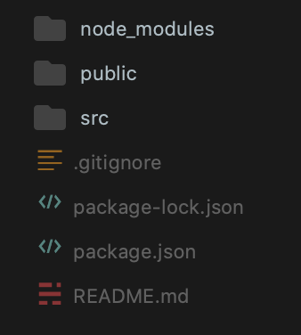
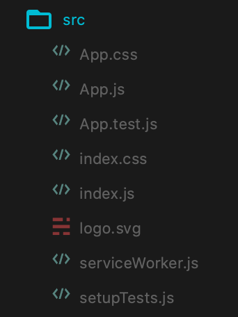
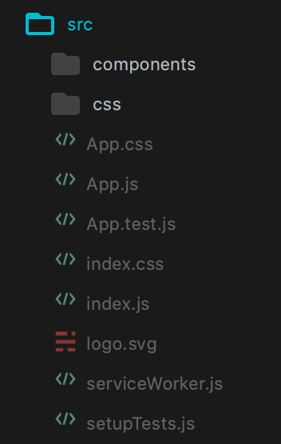
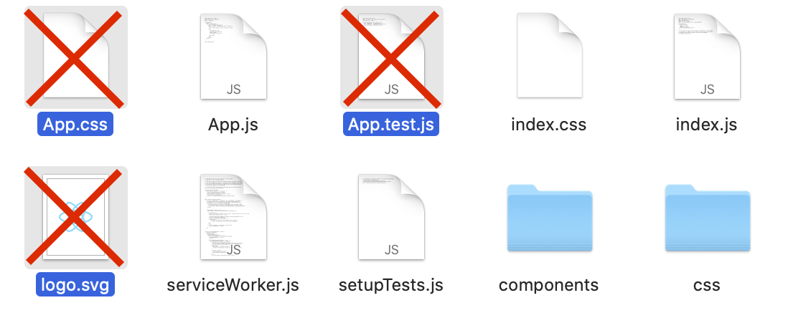
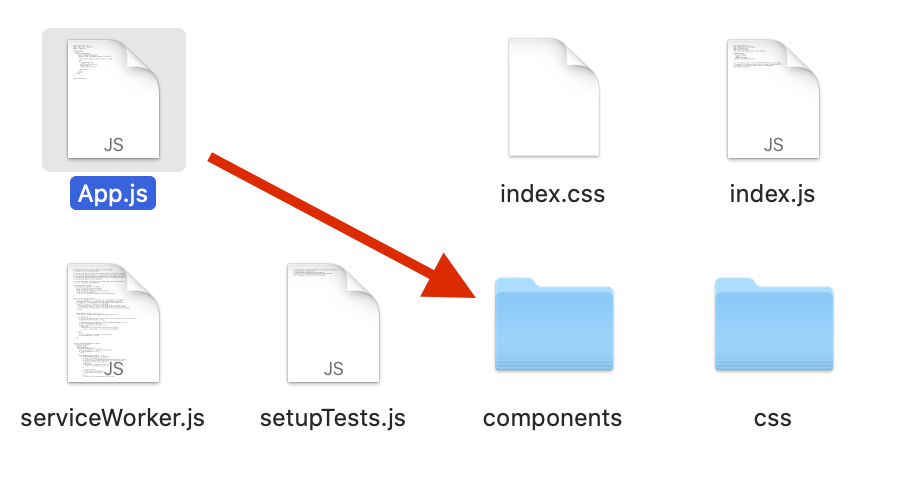
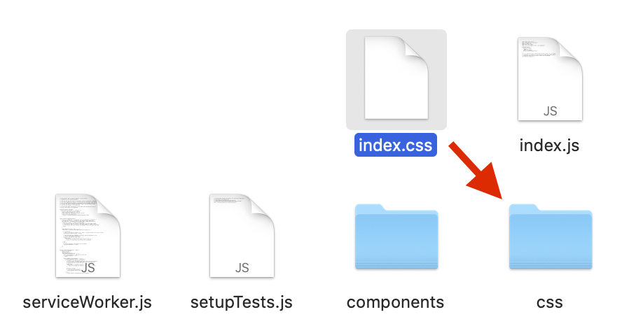
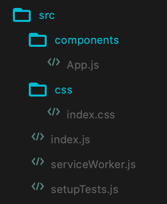
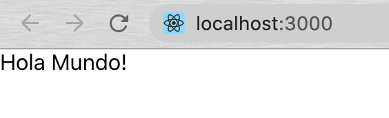

## Buenas prácticas para empezar un proyecto

1. Una vez creada la app con `npx create-react-app`, se nos generarán varios archivos automaticamente.


2. Entramos a `src` y veremos los siguientes archivos:


3. `create-react-app` nos da lo necesario para empezar un proyecto pero no lo hace ordenado, por lo que vamos a agrupar y ordenar estos archivos.

4. Creamos 2 carpetas dentro de `src` llamadas `components` y `css` en minúsculas.


5. Eliminamos los siguientes 3 archivos:


6. Movemos `App.js` a la carpeta `components`.


7. Movemos `index.css` a la carpeta `css`.


8. Los archivos deben de estar ordenados de la siguiente manera:


9. La aplicación no va a funcionar en este momento porque tenemos que corregir las referencias en los archivos.

10. Abrimos `src/index.js` y corregimos las lineas 3 y 4.
```
import React from 'react';
import ReactDOM from 'react-dom';
import './css/index.css';
import App from './components/App';
import * as serviceWorker from './serviceWorker';

ReactDOM.render(
   <React.StrictMode>
      <App />
   </React.StrictMode>,
   document.getElementById('root')
);

// If you want your app to work offline and load faster, you can change
// unregister() to register() below. Note this comes with some pitfalls.
// Learn more about service workers: https://bit.ly/CRA-PWA
serviceWorker.unregister();
```

11. Abrimos `src/components/App.js` y reemplazamos todo el componente con lo siguiente:
```
import React from 'react';

const App = () => {
   return (
      <div>
         Hola Mundo!
      </div>
   );
};

export default App;
```

12. Abrimos la terminal para comenzar nuestra aplicación con `npm start`, se abrirá el navegador y debemos de ver lo siguiente:


13. Seguir estos pasos no es obligatorio, pero es recomendado para ordenar el proyecto desde el principio.
