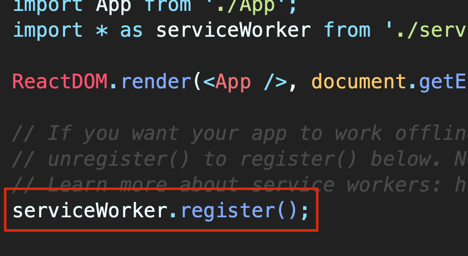
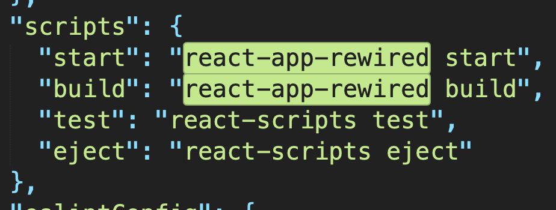
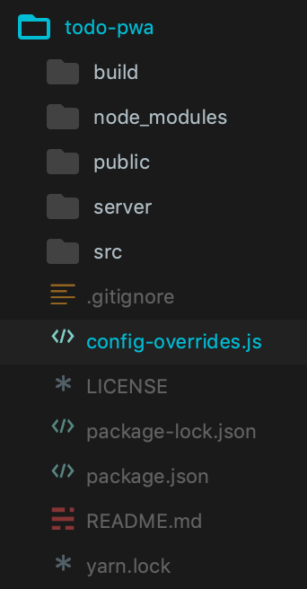
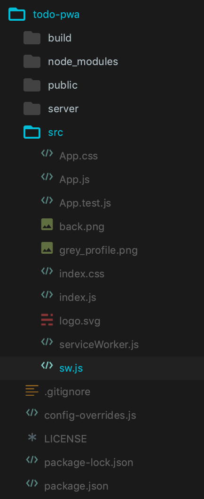
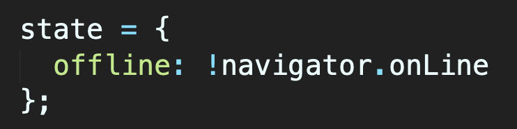
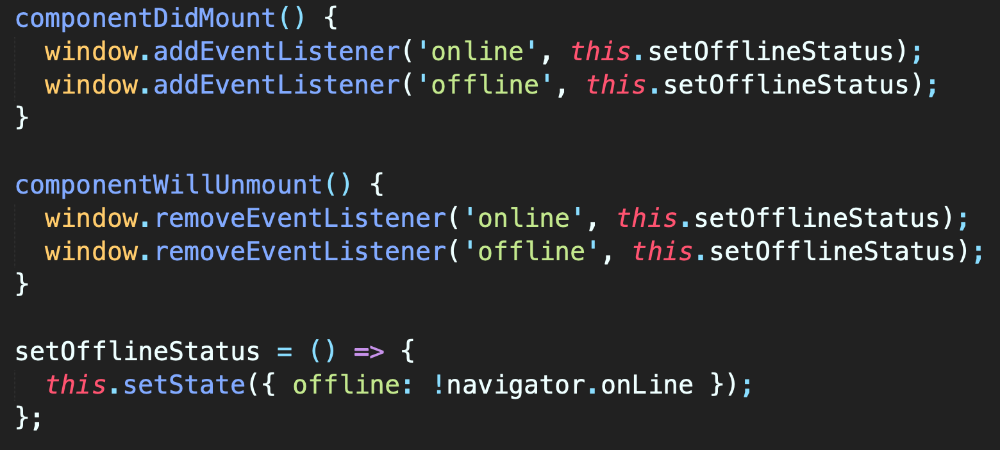
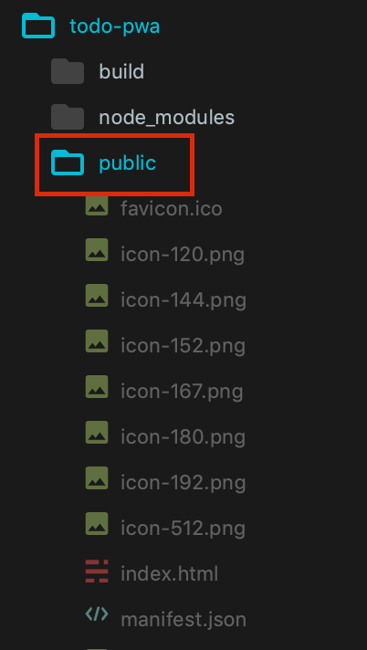
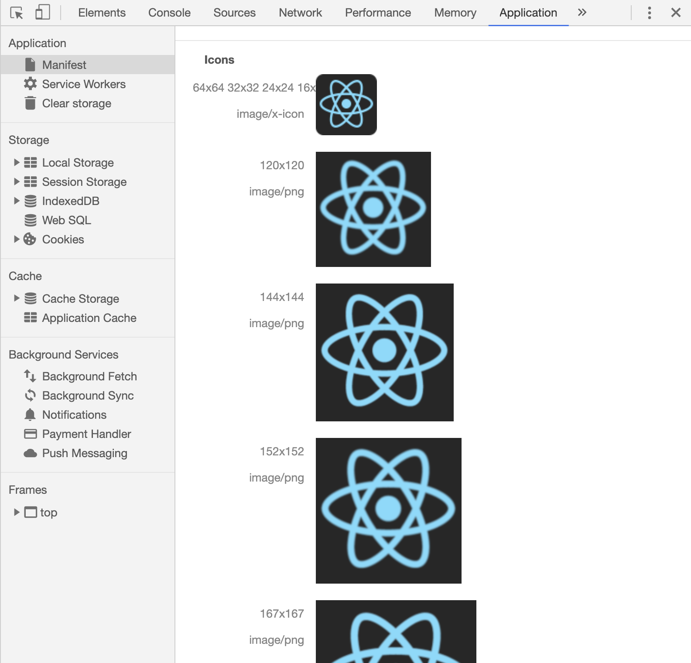
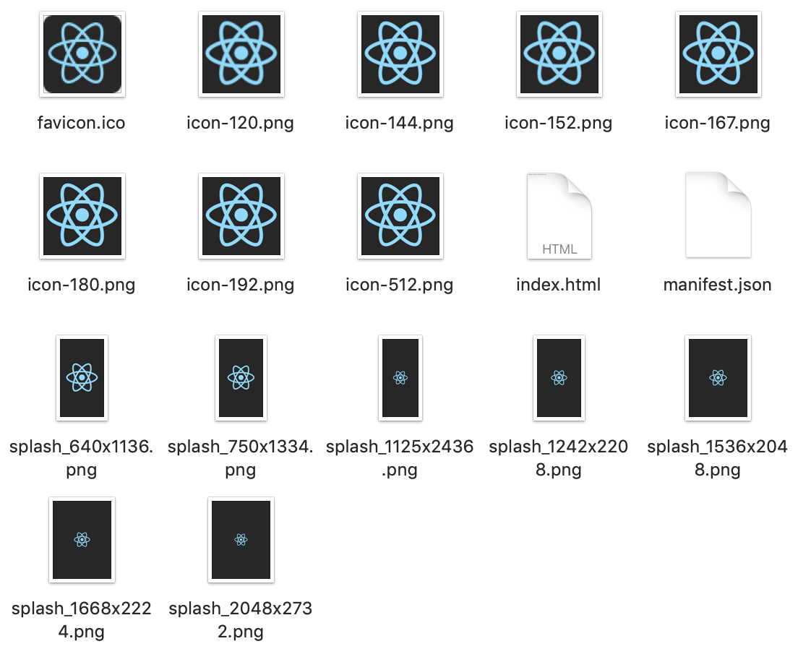
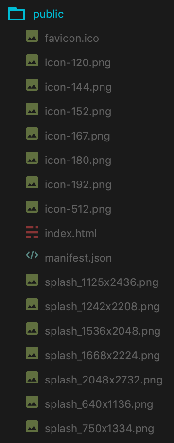

# Create React App
Cada vez que creamos una nueva app con `create-react-app` viene con código predefinido en el `index.js` y un `serviceWorker.unregister();`.
<br />
Para habilitar la PWA tenemos que registrarlo con `register()`.
<br />


# Habilitar [Workbox](https://developers.google.com/web/tools/workbox)
En la terminal instalamos una librería, `npm install react-app-rewired` lo que nos permitirá reescribir la configuración de webpack sin necesidad de `eject` nuestra app.
<br />
Cambia la versión del `package.json` a `1.0.0`. También cambia los scripts `start` y `build` a que usen la librería instalada (solo esos 2).


Crea un nuevo archivo `config-overrides.js` en la raíz del proyecto con el siguiente código:
```
const WorkboxWebpackPlugin = require('workbox-webpack-plugin');

module.exports = function override(config) {
  config.plugins = config.plugins.map((plugin) => {
    if (plugin.constructor.name === 'GenerateSW') {
      return new WorkboxWebpackPlugin.InjectManifest({
        swSrc: './src/sw.js',
        swDest: 'service-worker.js'
      });
    }

    return plugin;
  });

  return config;
};
```


Crea un service worker `sw.js` dentro del folder `src` con lo siguiente:
```
self.skipWaiting()

workbox.routing.registerRoute(
  new RegExp('https:.*min\.(css|js)'),
  new workbox.strategies.StaleWhileRevalidate({
    cacheName: 'cdn-cache'
  })
)

workbox.routing.registerRoute(
  new RegExp('.*\.json'),
  new workbox.strategies.NetworkFirst()
)

self.addEventListener('fetch', event => {
  if(event.request.method === 'POST' || event.request.method === 'DELETE') {
    event.respondWith(
      fetch(event.request).catch(err => {
        return new Response(
          JSON.stringify({ error: 'This action disabled while app is offline' }), {
            headers: { 'Content-Type': 'application/json' }
          }
        )
      })
    )
  }
})

self.addEventListener('push', event => {
  event.waitUntil(self.registration.showNotification('Mi PWA', {
    icon: '/logo192.png',
    body: event.data.text()
  }))
})

// Comentar para prevenir que la PWA guarde cache
workbox.precaching.precacheAndRoute(self.__precacheManifest || [])
```


# Nomenclatura
Dentro de `public/manifest.json` podemos especificar un nombre (`name`) y nombre corto (`short_name`).
<br />
El `short_name` tiene una longitud de máximo 12 caracteres y es usado cuando la app es instalada en los dispositivos.
<br />
El `name` tiene máximo 45 caracteres; es usado en la Chrome Web Store y en los dialogos de instalación.
<br />
Si no se especifica un `short_name`, el `name` será usado y truncado de ser necesario.

# Configuración HTML final
Ve a `public/index.html` y asegurate de tener el siguiente código en el tag de `<head>`:
```
<meta name="apple-mobile-web-app-status-bar-style" content="default">
<meta name="viewport" content="width=device-width, initial-scale=1, shrink-to-fit=no">
<meta name="apple-mobile-web-app-capable" content="yes"> 

<link rel="manifest" href="%PUBLIC_URL%/manifest.json">
```

# Verificar estado `offline` (opcional)
Podemos llamar a `navigator.onLine` para ver si la app esta en línea o no.
<br />
Podemos crear el estado como booleano.
<br />


Después crear los `event listeners` para manejar el estado.


# Íconos (opcional)
Asegurarse de subir los íconos con las dimensiones necesarias; 8 son los necesarios. Estos van en el folder `public`.
<br />



Ve al folder `public` y abre los archivos `manifest.json` e `index.html`.
<br />
Dentro de `manifest.json` especificar los íconos:
```
{
  "short_name": "Todo List",
  "name": "My PWA Todo List",
  "icons": [
    {
      "src": "favicon.ico",
      "sizes": "64x64 32x32 24x24 16x16",
      "type": "image/x-icon"
    },
    {
      "src": "icon-120.png",
      "sizes": "120x120",
      "type": "image/png"
    },
    {
      "src": "icon-144.png",
      "sizes": "144x144",
      "type": "image/png"
    },
    {
      "src": "icon-152.png",
      "sizes": "152x152",
      "type": "image/png"
    },
    {
      "src": "icon-167.png",
      "sizes": "167x167",
      "type": "image/png"
    },
    {
      "src": "icon-180.png",
      "sizes": "180x180",
      "type": "image/png"
    },
    {
      "src": "icon-192.png",
      "sizes": "192x192",
      "type": "image/png"
    },
    {
      "src": "icon-512.png",
      "sizes": "512x512",
      "type": "image/png"
    }
  ],
  "start_url": ".",
  "display": "standalone",
  "theme_color": "#000000"
}

```

Para IOS necesitamos expecificar los íconos directo en el `index.html`; hay que ponerlos en el tag de `head`.
```
<link rel="apple-touch-icon" href="icon-120.png">
<link rel="apple-touch-icon" sizes="152x152" href="icon-152.png">
<link rel="apple-touch-icon" sizes="180x180" href="icon-180.png">
<link rel="apple-touch-icon" sizes="167x167" href="icon-167.png">
```

Cuando la app este en producción, podremos ver todos los íconos configurados:


# Pantallas de bienvenida (opcional)
Android despliega una [pantalla de bienvenida](https://www.google.com/search?q=splash+screen&sxsrf=ALeKk02ZE6j32IrLwa7e3ibg93my8nGODg:1596111514161&source=lnms&tbm=isch&sa=X&ved=2ahUKEwiO68re-vTqAhWJJTQIHUOGCqoQ_AUoAXoECBMQAw&biw=1440&bih=821) basada en el ícono y nombre que se configuró, pero IOS solo despliega un color sólido por defecto.
<br />
Podemos hacer nuevas pantallas de bienvenida para cada resolución de los dispositivos IOS que queramos soportar, después creamos tags de `link` dentro de `public/index.html` para especificar esas imagenes como las bienvenidas para cada resolución.
```
<link rel="apple-touch-startup-image" href="splash_640x1136.jpg" media="(device-width: 320px) and (device-height: 568px) and (-webkit-device-pixel-ratio: 2) and (orientation: portrait)">
<link rel="apple-touch-startup-image" href="splash_750x1334.jpg" media="(device-width: 375px) and (device-height: 667px) and (-webkit-device-pixel-ratio: 2) and (orientation: portrait)">
<link rel="apple-touch-startup-image" href="splash_1242x2208.jpg" media="(device-width: 414px) and (device-height: 736px) and (-webkit-device-pixel-ratio: 3) and (orientation: portrait)">
<link rel="apple-touch-startup-image" href="splash_1125x2436.jpg" media="(device-width: 375px) and (device-height: 812px) and (-webkit-device-pixel-ratio: 3) and (orientation: portrait)">
<link rel="apple-touch-startup-image" href="splash_1536x2048.jpg" media="(min-device-width: 768px) and (max-device-width: 1024px) and (-webkit-min-device-pixel-ratio: 2) and (orientation: portrait)">
<link rel="apple-touch-startup-image" href="splash_1668x2224.jpg" media="(min-device-width: 834px) and (max-device-width: 834px) and (-webkit-min-device-pixel-ratio: 2) and (orientation: portrait)">
<link rel="apple-touch-startup-image" href="splash_2048x2732.jpg" media="(min-device-width: 1024px) and (max-device-width: 1024px) and (-webkit-min-device-pixel-ratio: 2) and (orientation: portrait)">
```
Hay que asegurarse de agregar estas imagenes al folder `public`. Así es como el folder debería de verse al finalizar.


