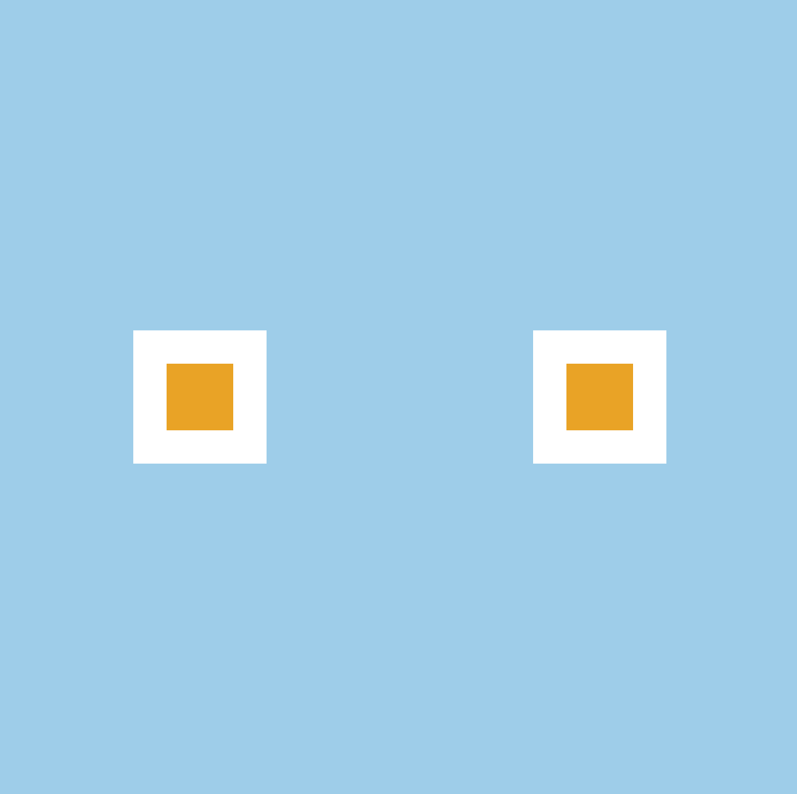

[`React Fundamentals`](../../README.md) > [`Sesión 01: Fundamentos de React`](../Readme.md) > `Ejemplo 1`

## Techo del cielo

### OBJETIVO 
- Comenzar proyectos con buenas prácticas.
- Diferenciar HTML y JSX.
- Conocer 2 maneras de usar CSS con React.

#### REQUISITOS 
- Tener Node instalado.

#### DESARROLLO

1. Comenzar nuevo proyecto de React con el comando `npx create-react-app ejemplo1`.

2. Seguir las [buenas prácticas para empezar un proyecto](../../BuenasPracticas/EmpezandoProyectos/Readme.md).

3. Crear nuestro `div` principal que nos servira como techo.
```
import React from 'react';

function App() {
   return (
      <div id="techo">
         techo
      </div>
   );
}

export default App;
```

4. Ir a `index.css` para crear el CSS de nuestro techo.
```
#techo {
   width: 600px;
   height: 600px;
   background-color: skyblue;
}
```

5. Crear otro `div` hijo que nos servirá como foco. Notar primer diferencia en como usamos las clases de CSS.
```
import React from 'react';

function App() {
   return (
      <div id="techo">
         techo
         <div className="foco">
            foco
         </div>
      </div>
   );
}

export default App;
``` 

6. Ir a `index.css` para crear el CSS de nuestros focos.
```
.foco {
   width: 100px;
   height: 100px;
   background-color: white;
}
```

7. Como queremos 2 focos, vamos a copiar y pegar el `div` del foco.
```
import React from 'react';

function App() {
   return (
      <div id="techo">
         techo
         <div className="foco">
            foco
         </div>
         <div className="foco">
            foco
         </div>
      </div>
   );
}

export default App;
```

8. Queremos los focos ordenados en fila, lo arreglamos con flexbox.
```
#techo {
   width: 600px;
   height: 600px;
   background-color: skyblue;
   display: flex;
   align-items: center;
   justify-content: space-around;
}
```

9. Eliminamos la palabra "techo" que nos estorba.
```
import React from 'react';

function App() {
   return (
      <div id="techo">
         <div className="foco">
            foco
         </div>
         <div className="foco">
            foco
         </div>
      </div>
   );
}

export default App;
```

10. Estamos repitiendo exactamente el mismo código del foco; creamos nuevo componente dentro de la carpeta `components` como `Foco.js`.
```
import React from 'react';

const Foco = () => {
   return (
      <div className="foco">
         foco
      </div>
   );
};

export default Foco;
```

11. Importamos el componente en `App.js` y lo usamos. Hay que notar que podemos usar componentes en 1 sola linea.
```
import React from 'react';
import Foco from './Foco';

function App() {
   return (
      <div id="techo">
         <Foco />
         <Foco />
      </div>
   );
}

export default App;
```

12. Ahora nuestro foco necesita de una luz; creamos el componente, lo usamos y quitamos la palabra "foco".
```
import React from 'react';

const Luz = () => {
   return (
      <div>
         luz
      </div>
   );
};

export default Luz;
```

```
import React from 'react';
import Luz from './Luz';

const Foco = () => {
   return (
      <div className="foco">
         <Luz />
      </div>
   );
};

export default Foco;
```

13. Como necesitamos que la luz este enmedio, hacemos que el foco use flexbox.
```
.foco {
   width: 100px;
   height: 100px;
   background-color: white;
   display: flex;
   align-items: center;
   justify-content: space-around;
}
```

14. Ahora vamos a agregarle color a la luz usando un nuevo CSS; creamos archivo `Luz.css` (src/css/Luz.css).
```
.luz {
   width: 50px;
   height: 50px;
   background-color: orange;
}
```

15. Importamos el CSS en el componente, lo usamos y eliminamos la palabra "luz". Ahora ya se conocen 2 maneras de usar css, por componente o global.
```
import React from 'react';
import '../css/Luz.css';

const Luz = () => {
   return (
      <div className="luz">
      </div>
   );
};

export default Luz;
```

16. Resultado


-------

[`Siguiente: Reto-01`](../Reto-01)
