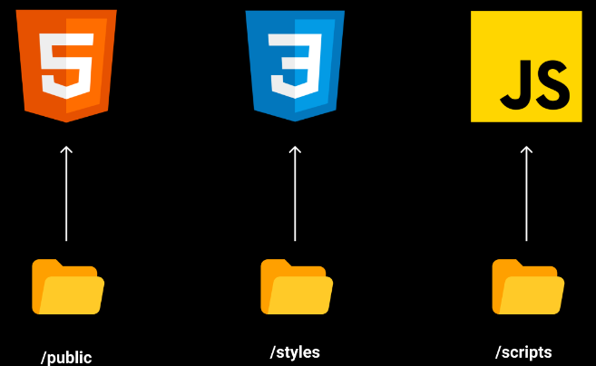
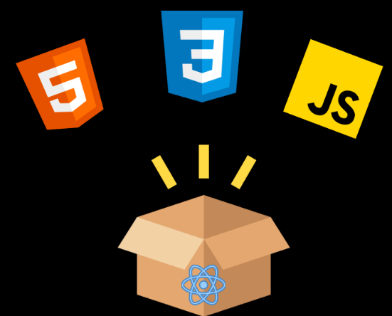
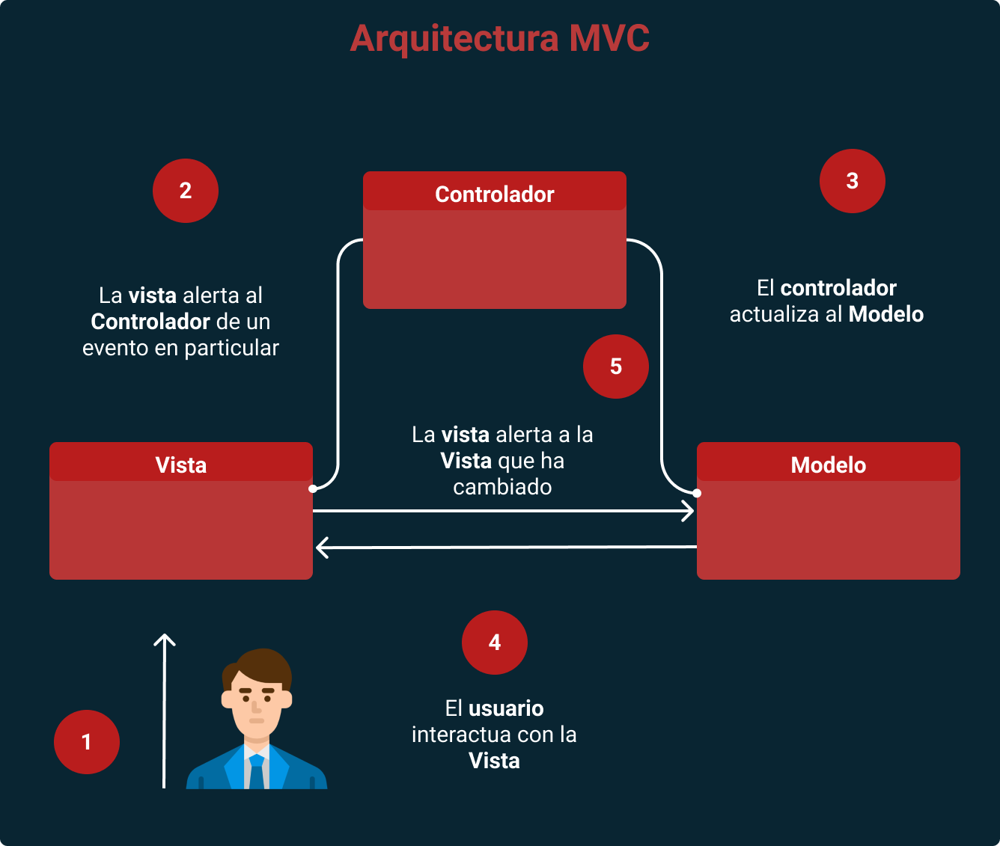
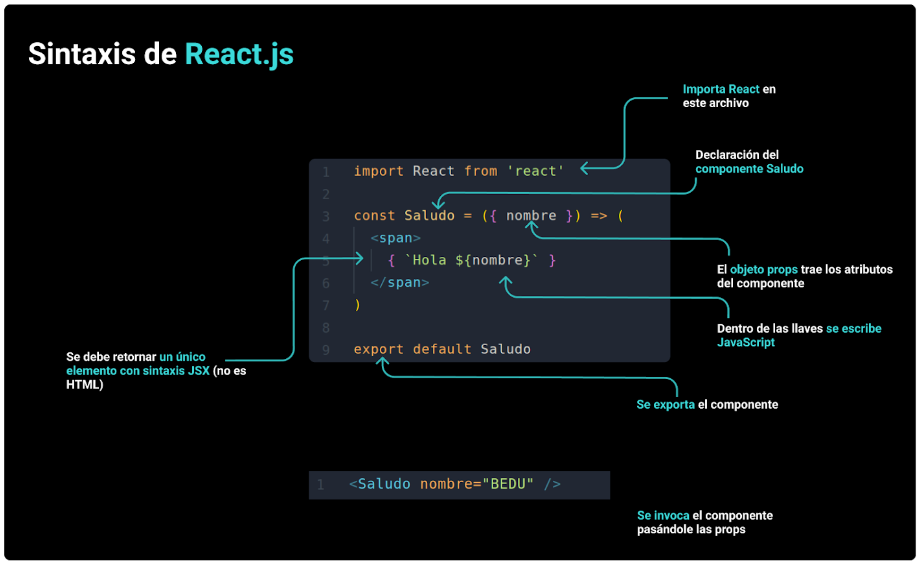
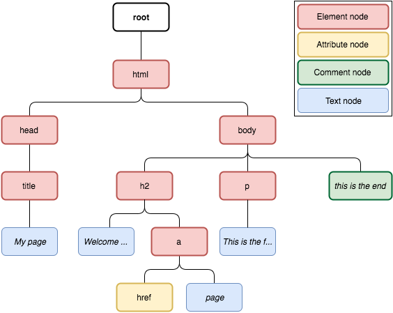
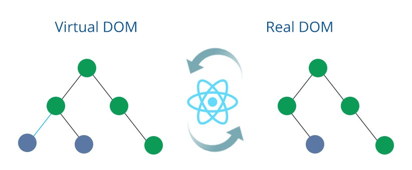
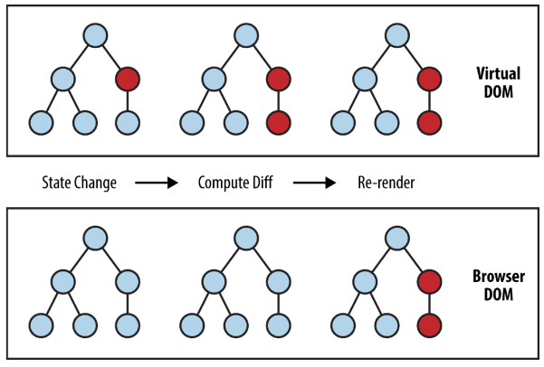
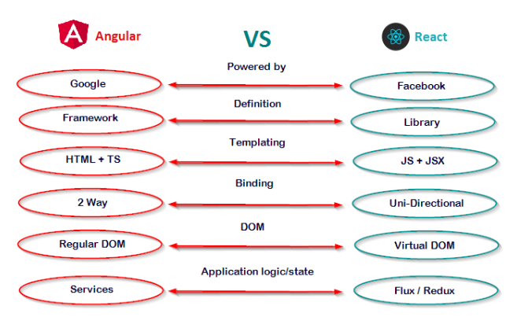
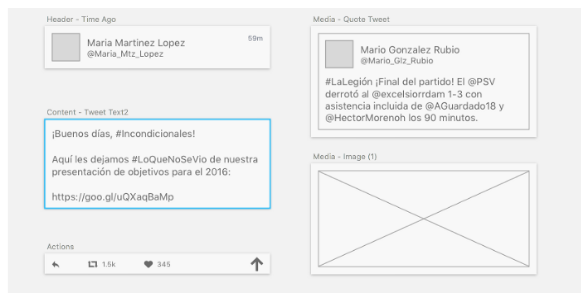
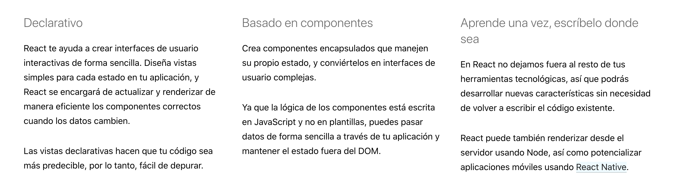

[`Backend Fundamentals`](../../README.md) > [`Sesión 01: Fundamentos de React`](../Readme.md) > `Prework`

### OBJETIVO
- Conocer qué es **React**.
- Leer sobre qué es **JSX** y como es su
**sintaxis**.
- Entender el **virtual DOM**.

## Sesión 01

### ¿Cómo vivíamos antes de React.js?

La web tradicionalmente se ha construido en **HTML**, **JavaScript** y **CSS**, separados en distintas carpetas. Eso hace que sea complicado escalar y extraer ciertas partes del código (especialmente **JS** y **CSS**) para migrar o reutilizar funcionalidades debido a las dependencias entre estos lenguajes.

**Ejemplo:**



**La web está construida con 3 lenguajes básicos:**

+ **HTML** es la estructura e información de  la página web y es completamente estático.
+ **CSS** es el maquillaje para **HTML**, con **CSS** puedes hacer que la información se vea bonita y se adapte a todos los tamaños de pantalla (responsive).
+ **JavaScript** a diferencia de **HTML** y **CSS** es un lenguaje de programación. Podemos darle vida a la página haciendo que responda a las acciones del usuario.

**Con estos tres lenguajes ya podemos crear aplicaciones web completas, sin embargo, siempre los hemos separado en distintas carpetas:**

+ 📂 Public para HTML
+ 📂 Styles para CSS
+ 📂 Scripts para JavaScript

Pueden tener otros nombres pero esos son los más comunes y para nosotros esta siempre ha sido una buena práctica.

### Pero .. ¿Por qué no separar HTML CSS y JavaScript y dejarlos juntos?



Un día llegó el equipo de React y propuso meter todo en un solo paquete llamado **componente**, y de seguro estas pensando **"Esto va contra las buenas prácticas"** parece que intentan regresar a los años 90 cuando en el mismo HTML metemos el CSS y JavaScript. **¿Por qué lo proponen?** Al guardar estos lenguajes en carpetas, estas separando por **código** y no por **funcionalidad**.

>💡 **Nota:**
>
>Ahora que hemos visto porque en Rect es importante mantener los 3 archivos juntos, vamos a comprender otro concepto y su importancia

### ¿Qué es MVC?

Es una **arquitectura** de **software** que permite organizar las partes de una aplicación de la siguiente manera:

+ **Modelo**. Los datos de la aplicación y el acceso a ellos
+ **Vista**. La interfaz con la que interactúa el usuario con los datos entregados por el modelo.
+ **Controlador**. La lógica de negocio, lo que debe hacer la aplicación. El controlador es una especie de puente entre la vista y el modelo.



### Y a todo esto…. ¿Qué es React?

**React** también llamada **ReactJS** es una librería de **JavaScript** creada por *Facebook* y publicada como *OpenSource*, que se diseñó para ayudarnos a desarrollar aplicaciones **SPA (Single Page Applications).**

### El lanzamiento de React.js

En **2013**, **Pete Hunt** presentó React como solo la vista (V) en el modelo MVC en el JSConf EU en una charla titulada: "React: Repensando las buenas prácticas". En esencia React proponía:

+ **Construir componentes**, no templates porque la lógica está inevitablemente unida al marcado del elemento.
+ **Los componentes son bloques** cohesionados de piezas de UI reutilizables.
+ **No más two way data binding (enfoque de AngularJS)** sino cambiar cada componente en cada actualización
+ **Virtual DOM** para optimizar las actualizaciones del DOM
+ **JSX** para escribir el marcado dentro de JavaScript con una sintaxis sencilla en que incluso los diseñadores web puedan contribuir porque es casi idéntico a HTML.

**A continuación te dejamos el video del lanzamiento de React**

[](http://www.youtube.com/watch?v=x7cQ3mrcKaY "http://img.youtube.com/vi/x7cQ3mrcKaY/0.jpg")

>❗ **Importante:**
>
>**React** está basado en un paradigma llamado **programación orientada a componentes** en el que cada componente es una pieza con la que el usuario puede interactuar. Estas piezas se crean usando una sintaxis llamada JSX.

### ¿Qué es JSX?

**JSX** es un **lenguaje**, el cual, es una extensión al lenguaje **JavaScript** que permite agregar etiquetas XML en un fragmento de código JavaScript. Esto nos permite definir el código **HTML** de nuestro componente directamente en el archivo **JavaScript**.

No es obligatorio usar JSX, se pueden implementar usando código JavaScript regular, con la **desventaja** que el código resultante es más difícil de entender para los desarrolladores.

Debido a que los navegadores web no entienden el código escrito en JSX, se hace necesario usar un traductor para convertirlo a código JavaScript regular y este traductor es [**Babel**](https://babeljs.io) , un compilador para la nueva generación de JavaScript que precisamente puede realizar dicha traducción.

**En resumen** es una forma de escribir HTML en **JavaScript** con una sintaxis muy parecida a HTML que luego es transformada en la compilación. Cuando se presentó fue amada y odiada por igual. **¿HTML en JavaScript? ¡Qué abominación! ¿XML en JavaScript (parecía XML 😅)?**

Sin embargo, la comunidad terminó aceptando que JSX **les ahorraba mucho tiempo** en la **creación** de **componentes** y hacía el desarrollo mucho más natural.

**Usando JSX podemos crear elementos React fácilmente:**

```js
let element = <h1>Hello World!</h1>
```

**En cambio si no tenemos JSX, el proceso es mucho más lento y menos legible:**

```js
let element = React.createElement(
        'h1',
        null,
        'Hello World!'
      )
```

**Además, JSX permite escribir expresiones más complejas:**

```js
let item = {
        name: "Cheese",
        price: 5
    }

let element = <p>{item.name} : ${item.price} </p>
```

Estos componentes son reutilizables y se combinan para crear componentes mayores hasta configurar una web completa.
Esta es la forma de tener HTML con toda la funcionalidad de JavaScript y el estilo gráfico de CSS centralizado y listo para ser abstraído y usado en cualquier otro proyecto.
React aporta una serie de claras ventajas frente a la forma clásica de realizar una web, sus facilidades para el desarrollo unido al **rendimiento**, la **flexibilidad** y ***organización*** del **código**.

### ¿Qué aceptación tiene en el mercado?

La última encuesta de **StackOverflow** nos revela que React es el **framework más querido y más deseado en este último año**, además de ser ya el segundo más usado solo por detrás de **jQuery**. Esto está fuertemente ligado a que Javascript vuelve a ser el **lenguaje más popular por séptimo año consecutivo**, cosa que marca una tendencia claramente ascendente.

No es casualidad que empresas como **Netflix**, **Airbnb**, **Dropbox**, **Paypal**, **Tesla**, **Whatsapp**, **Uber**, etc. hayan apostado por esta tecnología, la inversión que ha hecho Facebook junto al gran número de desarrolladores que han contribuido a esta librería de código abierto hacen que sea una apuesta segura de futuro.

### Sintaxis básica de React.js




>💡 **Nota:**
>
>Tranquilo, se que pueden ser muchos conceptos, pero recuerda que conociendo Javacript, React se hace un poco más sencillo. 😉

### Virtual DOM

### Para empezar... ¿Qué es Real DOM?

Pero antes de nada, si hay un Virtual DOM tendrá que haber algo real, **¿no?** En efecto, el **DOM (cuyas siglas son “Document Object Model)** es la representación de la interfaz gráfica de nuestra aplicación. Por tanto, cada vez que el estado de la aplicación cambia, lo **esperable** es que también lo haga dicha interfaz para adaptarse a las modificaciones introducidas. Sin embargo, actualizar el DOM es una tarea costosa en cuanto a rendimiento se refiere, por lo que cuantos más cambios de estado sea necesario reflejar en él, más lento irá nuestra web.

**¿Y por qué es tan lento realizar esos cambios?**

EL DOM posee una estructura en forma de árbol:



Esto provoca que cada vez que modificamos un elemento dentro de él, todos sus hijos tengan que ser **pintados de nuevo (hayan o no cambiado).** Y justo este proceso es el que provoca los problemas de rendimiento, ya que de por sí renderizar **elementos en una interfaz gráfica** es una tarea costosa. Por tanto, cuantos más elementos queden por debajo de nuestro elemento modificado en la estructura del DOM más elementos tendrán que ser vueltos a pintar en la interfaz gráfica. Y es aquí donde entra el concepto del Virtual DOM con el objetivo de conseguir **optimizar esta tarea**.

### ¿Qué es Virtual DOM?

**Virtual DOM** es una representación en memoria del **DOM real** que actúa de intermediario entre el estado de la aplicación y el **DOM** de la interfaz gráfica que está viendo el usuario.



Puesto que cada elemento es un nodo en el árbol del DOM, cada vez que se produce un cambio en cualquiera de estos elementos (o un nuevo elemento es añadido) se genera un nuevo Virtual DOM con el **árbol resultante.** Dado que este **DOM es virtual**, la interfaz gráfica aún no es actualizada, sino que se compara el DOM real con este DOM virtual con el objetivo de calcular la forma más óptima de realizar los cambios (es decir, de **renderizar** los **menos** cambios posibles). De este modo se consigue reducir el coste en términos de rendimiento de actualizar el DOM real.



**State Change.** En este primer paso, se produce un cambio en el estado del nodo de color de rojo, lo cual provoca que se genere en memoria un Virtual DOM con el árbol resultante tras ese cambio.
**Compute diff.** A continuación se realiza la comparación entre el árbol del Virtual DOM y el del navegador (DOM real) con el fin de detectar los cambios producidos. **Cómo ves, el cambio afecta a toda la rama descendiente del nodo cuyo estado cambió.**
**Re-render.* *Finalmente, se consolida el cambio en el DOM real y la interfaz gráfica es actualizada de golpe.

### ¿Por qué usar Virtual DOM y no solo el DOM?


El Virtual DOM es una de las características importantes en la toma de decisión.

Es también una de las **diferencias** importantes con uno de los frameworks más utilizados como es **Angular** junto con el binding que en **Angular** es **bidireccional** y en **React** es **unidireccional**.

**¿Esto último qué significa?** Que el flujo de información a través de los componentes de React es unidireccional. Cada componente pasa la información a sus componentes hijos y no al revés. Esto hace fácil el seguimiento y razonamiento sobre cómo los datos se mueven a través de la aplicación. Gracias a este detalle, es más sencilla la planeación y detección de errores en aplicaciones complejas.

En la imagen siguiente se puede ver una comparativa entre el framework de Google y la librería de Facebook:



### ¿Qué es la arquitectura basada en componentes y qué ventajas aporta?

Vamos a construir interfaces de usuario **(UI)** utilizando componentes reutilizables, que **poseen** y **manejan** un **estado propio**. Usamos estos componentes como si fueran **bloques de Lego**, para construir **componentes** más complejos y eventualmente una **aplicación entera.**



>💡 **Nota:**
>
>Llamamos **estado(state)** a las **características** propias de un componente. Por ejemplo, cuando tenemos un componente que hace requests a un server, puede tener **dos estados posibles, pendiente o finalizado**.
>La lógica de los componentes se **escribe** en **JavaScript** (y **no** utilizando templates, como es el caso de otras librerías o frameworks de front end), por lo que podemos pasar **propiedades (props)** de forma simple y mantener el estado fuera del **DOM**.

### ¿Qué es un componente?

>“Los componentes nacen, crecen, se renderizan y mueren 🙂 ”

Un **componente** es un **bloque de código reutilizable**, **una pieza de UI con contenido, estilos y comportamiento definidos: contiene todo el HTML, CSS y JS necesario para funcionar**.

React.js separa tu código en pequeñas partes llamadas **Componentes** que pueden **crearse / definirse** como **class** o como **function**. Cada componente es como una aplicación de React más pequeña que tiene su propia lógica y tiene un propósito final que es mostrar (**Render**) algo.

**Ejemplo:**

**Esta es la interfaz de BEDU**


Cada elemento de esta página (**logo, icono de búsqueda, carrito, icono de menú, texto, botones**, etc) es un bloque de interfaz. La filosofía de React.js es separar el proyecto por piezas de tal manera que el código pueda ser reutilizable, por ejemplo, si yo necesito otro botón, s**implemente reutilizó el componente que genera el botón**.

**¿Qué pasa si quieres reutilizar un menú en otro proyecto?**

En el modelo tradicional pasaba esto:

+ Extraer el HTML era sencillo
+ Extraer el JavaScript era muy complejo ¿Cual la función es la que interactúa con el menú?¿Y si la función está comprometida con otra?
+ Traer el CSS era un infierno, en el mejor de los casos tenias que cambiar ids y clases para que los estilos coincidan y no se rompan con los estilos del otro proyecto

Para React.js HTML y JavaScript siempre están unidos, opcionalmente puedes escribir CSS dentro del componente o puedes trabajarlo de manera tradicional (Por fuera).
Por lo tanto, en React, **cada parte de la UI es un component**e y cada componente tiene un **estado**.
Si el estado de nuestra aplicación indica por ejemplo, que un usuario se encuentra logueado, crearemos los componentes correspondientes basados en esa información.

> 💡 **Nota:**
>
>Las props son inmutables y siempre se pasan de componentes superiores a componentes inferiores.

```js
// Como: function

function NavBar(props){
    return (<nav className="navbar navbar-light bg-light">
              <a className="navbar-brand" href="#">Navbar</a>
           </nav>);
}
```

```js
//Como: class
import React from 'react';
class Navbar extends React.Component{
    render(){
        return (<nav className="navbar navbar-light bg-light">
              <a className="navbar-brand" href="#">Navbar</a>
           </nav>);
    }
}
```

> **Recurda**
>
>React es:
>
>


>💡 **Nota:**
>
>Recuerda que la documentación oficial va a ser tu mejor amiga, por eso al final de tu prework podrás ver recursos de los temas vistos anteriormente.

**Recursos:**

1. [**¿Qué es React?**](https://es.reactjs.org/)
2. [**Introducción a JSX**](https://es.reactjs.org/docs/introducing-jsx.html).
3. [**Renderizando elementos**](https://es.reactjs.org/docs/rendering-elements.html)
4. [**Componentes y propiedades**](https://es.reactjs.org/docs/components-and-props.html)
