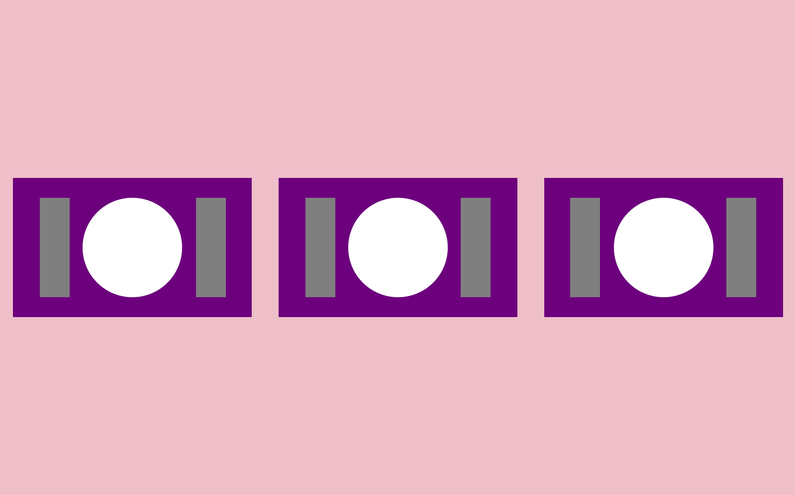

[`Backend Fundamentals`](../../README.md) > [`Sesión 01: Consola`](../Readme.md) >[`Ejemplo-01`](../Ejemplo-01) > `Reto 1`

## ¡A comer!

### OBJETIVO 
- Seguir buenas prácticas.
- Crear y utilizar componentes.
- Practicar flexbox

#### REQUISITOS 
- Tener Node instalado.

#### DESARROLLO

1. Comenzar un nuevo proyecto con `npx create-react-app reto1`.

2. Seguir las [buenas prácticas para empezar un proyecto](../../BuenasPracticas/EmpezandoProyectos/Readme.md).

3. Crear los componentes `Mesa`, `Mantel`, `Plato` y `Cubierto`.

4. Crear el CSS para los componentes en dado caso que sea necesario; puede ser global o por componente.

5. Conectar los componentes de tal modo que nos quede este resultado:

## ❗Importante

Si no pudiste resolver el reto, no te preocupes,😉 en la parte superior del repositorio encontrarás los archivos con la solución para tu consulta, pero recuerda lo importante es que **lo intentes primero.** 🤓

[`Atrás`](../Ejemplo-01)
