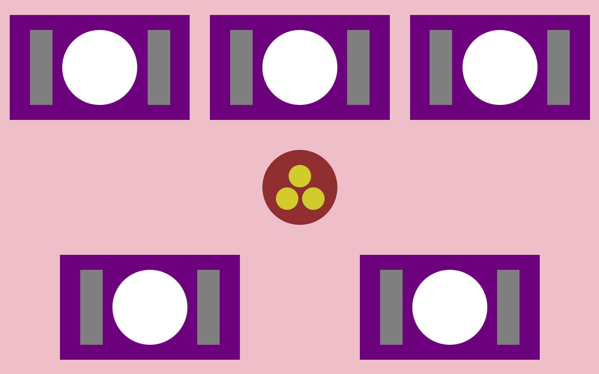

[`Backend Fundamentals`](../../README.md) > [`Sesión 01: Consola`](../Readme.md) >[`Ejemplo-02`](../Ejemplo-02) > `Reto 2`

## ¡Yo me lo llevo!

### OBJETIVO 
- Practicar creacion y reutilización de componentes.
- Practicar flexbox.

#### REQUISITOS 
- Tener Node instalado.
- Completar el [Reto-01](../Reto-01)

#### DESARROLLO

1. Abrir nuestro proyecto "A comer!" del [Reto-01](../Reto-01).

2. Crear el componente obligatorio `CentroDeMesa.js` y los que sean necesarios para obtener el resultado.

3. Crear el CSS para los componentes en dado caso que sea necesario; puede ser global o por componente.

4. Conectar los componentes de tal modo que nos quede este resultado:

5. Esperar a ver que tía se llevó el centro de mesa.

## ❗Importante

Si no pudiste resolver el reto, no te preocupes,😉 en la parte superior del repositorio encontrarás los archivos con la solución para tu consulta, pero recuerda lo importante es que **lo intentes primero.** 🤓

[`Atrás`](../Ejemplo-02)
