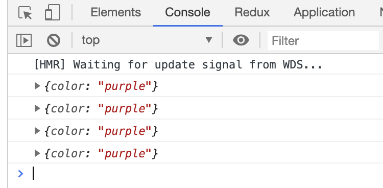
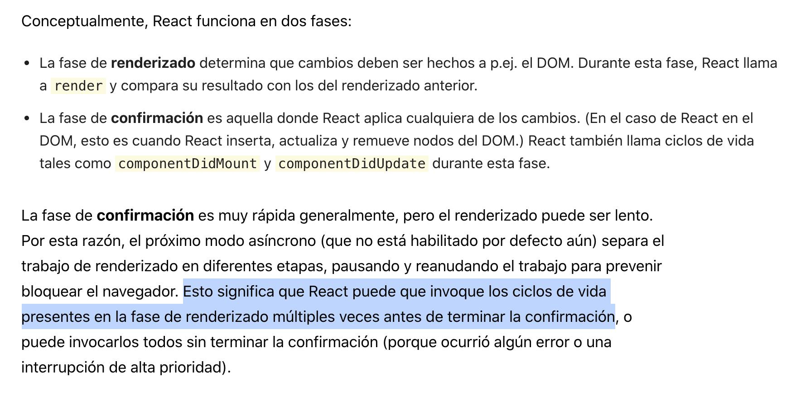

[`React Fundamentals`](../../README.md) > [`Sesión 02: Estado (state) y Propiedades (props)`](../Readme.md) > `Ejemplo 2`

## Gracias Abuelo

### OBJETIVO 
- **Declaración** y **utilización de propiedades (props)** en los 2 tipos de componente.
- **Buenas prácticas** de propiedades (librería prop-types).

#### REQUISITOS 
- Completar el [Ejemplo-01](../Ejemplo-01)

#### DESARROLLO

1. Abrir nuestro proyecto "Patricio" del [Ejemplo-01](../Ejemplo-01).

2. En este momento nuestras luces estan obedeciendo al estado para definir sus colores, vamos a cambiar esto.

3. Vamos a hacer que `LuzMercurial.js` pueda recibir algun color desde el componente que lo esta usando o usar su propio color en dado caso nada se le haya pasado.

4. Primero vamos a `FocoMercurial.js` que es el padre directo de `LuzMercurial.js` y le mandamos algún color a la luz con la instrucción `<LuzMercurial color="purple" />`.
```
import React from 'react';
import LuzMercurial from './LuzMercurial';

const FocoMercurial = () => {
   return (
      <div className="focoMercurial">
         <LuzMercurial color="purple" />
      </div>
   );
};

export default FocoMercurial;
```

5. Para asegurarnos que este valor si esta siendo recibido correctamente como propiedad (props), vamos a `LuzMercurial.js` e imprimirlo en la consola con `console.log(this.props)`.
```
import React from 'react';

class LuzMercurial extends React.Component {
   constructor(props) {
      super(props);
      this.state = {
         color: 'pink'
      };
   }

   render() {
      console.log(this.props);

      return (
         <div
            className="luzMercurial"
            style={{ backgroundColor: this.state.color }}
         />
      );
   }
};

export default LuzMercurial;
``` 

6. Vamos a notar que las propiedades nos aparecen 4 veces; y que curioso si solo estamos usando el componente 2 veces verdad?


7. [Aquí](https://es.reactjs.org/docs/strict-mode.html#detecting-unexpected-side-effects) nos explican exactamente porque.


8. Vamos a borrar el `console.log()` y decirle a la luz que obedesca primero a lo que le mandan; y si no, que use su propio estado.
```
import React from 'react';

class LuzMercurial extends React.Component {
   constructor(props) {
      super(props);
      this.state = {
         color: 'pink'
      };
   }

   render() {
      return (
         <div
            className="luzMercurial"
            style={{ backgroundColor: this.props.color || this.state.color }}
         />
      );
   }
};

export default LuzMercurial;
```

9. Hasta este punto la luz es controlada por `FocoMercurial.js` o por `LuzMercurial.js`. Se recomienda que las propiedades sean pasadas solamente 1 nivel abajo (exactamente como lo tenemos), porque después se hace mucho enredadero para saber de dónde es originalmente un parámetro.

10. PEEEEEEEERO; como estamos aprendiendo, nos vamos a pasar esa sugerencia por la cabeza solo esta vez, de oreja a oreja para que se nos grabe en el cerebro.

11. Vamos a hacer que al mismísimo `FocoMercurial.js` se le pase un parámetro y este también sea pasado a la luz.

12. Agregamos el parametro `props` en la declaración del componente `const FocoMercurial = (props) => {` y mandamos el parametro de color a la luz.
```
import React from 'react';
import LuzMercurial from './LuzMercurial';

const FocoMercurial = (props) => {
   return (
      <div className="focoMercurial">
         <LuzMercurial color={props.color} />
      </div>
   );
};

export default FocoMercurial;
```

13. Si vemos la aplicación, la luz mercurial regresó a ser rosa. Esto pasó porque el foco mercurial le esta pasando como color lo que a él le pasaron, pero pues todavía nadie le esta pasando nada.

14. Vamos a `App.js` y le pasamos colores diferentes a cada `<FocoMercurial />`.
```
import React from 'react';
import FilaFocos from './FilaFocos';
import FocoMercurial from './FocoMercurial';

function App() {
   return (
      <div id="techo">
         <FocoMercurial color="green" />
         <FilaFocos />
         <FocoMercurial color="brown" />
      </div>
   );
}

export default App;
```

15. Que bonito verdad? Y para que no se nos olvide, vamos a agregar un `<FocoMercurial />` más; pero sin color, para que agarre el color original (rosa).
```
import React from 'react';
import FilaFocos from './FilaFocos';
import FocoMercurial from './FocoMercurial';

function App() {
   return (
      <div id="techo">
         <FocoMercurial color="green" />
         <FilaFocos />
         <FocoMercurial color="brown" />
         <FocoMercurial />
      </div>
   );
}

export default App;
```

16. Fíjate bien en como manejamos las propiedades (props) de manera diferente en cada componente.
   - En los componentes stateless (funcionales) se tiene que recibir el parámetro a la hora de declarar y se usa solo como `props.nombrePropiedad`.
   - En los componentes stateful (clase) se tiene que referir en el `constructor` y se usa como `this.props.nombrePropiedad`.

17. Como paso final vamos a seguir las [buenas prácticas para propiedades (props)](../../BuenasPracticas/PropTypes/Readme.md) con los componentes `FocoMercurial.js` y `LuzMercurial.js`.

18. `FocoMercurial.js` nos va a quedar así:
```
import React from 'react';
import PropTypes from 'prop-types';
import LuzMercurial from './LuzMercurial';

const FocoMercurial = (props) => {
   return (
      <div className="focoMercurial">
         <LuzMercurial color={props.color} />
      </div>
   );
};

FocoMercurial.propTypes = {
   color: PropTypes.string,
}

export default FocoMercurial;
```

19. `LuzMercurial.js` nos va a quedar así:
```
import React from 'react';
import PropTypes from 'prop-types';

class LuzMercurial extends React.Component {
   constructor(props) {
      super(props);
      this.state = {
         color: 'pink'
      };
   }

   render() {
      return (
         <div
            className="luzMercurial"
            style={{ backgroundColor: this.props.color || this.state.color }}
         />
      );
   }
};

LuzMercurial.propTypes = {
   color: PropTypes.string,
}

export default LuzMercurial;
```

20. Resultado:


[`Siguiente: Reto-02`](../Reto-02)
