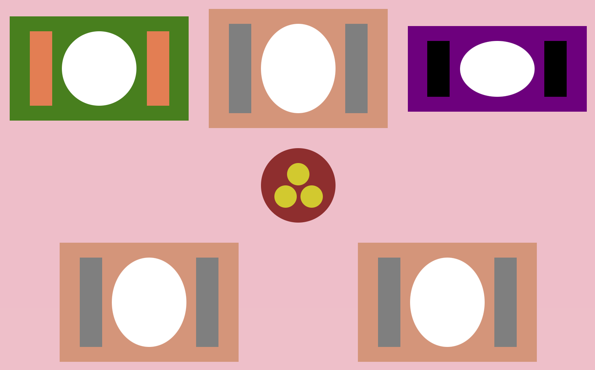

[`React Fundamentals`](../../README.md) > [`Sesión 02: Estado (state) y Propiedades (props)`](../Readme.md) > `Postwork`

#### REQUISITOS
- Tener Node instalado.
- Completar el [Reto-02](../Reto-02)


#### DESARROLLO

1. Abrir nuestro proyecto "Cada quien su mantel" del [Reto-02](../Reto-02).

2. Hacer que los `<Cubierto />` reciban como parámetro algún color o que usen el CSS por defecto.

3. Este color va a ser mandado a `<Mantel />` y debe de llegar hasta el `<Cubierto />`. Ejemplo:
```
<Mantel
   height={100}
   colorCubierto="coral"
   backgroundColor="green"
/>
```

4. No olvides seguir las [buenas prácticas para las propiedades (props)](../../BuenasPracticas/PropTypes/Readme.md).

5. Resultado:

