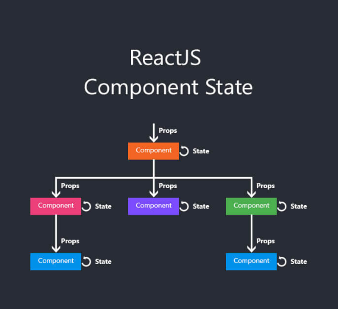

[`Backend Fundamentals`](../../README.md) > [`Estado (state) y Propiedades (props)`](../Readme.md) > `Prework`

### OBJETIVO
- Introducción de **componentes stateful (clase)**.
- Cómo **declarar**, **mandar** y usar **valores** para usarse como **propiedades**.

#### DESARROLLO

## ¿Qué son las Props (Propiedades)?

Las **propiedades** son la manera que tienen los **componentes** de React de **comunicarse** entre **sí**.

Cualquier componente puede **invocar** a otro, al que podemos definir como su **hijo**, y pasarle **propiedades** que conformarán datos que este va a **recibir** y poder **gestionar** de manera interna.

Este paso de propiedades es la forma que tienen de comunicarse entre ambos, y es una forma muy parecida a la que nos podemos encontrar en las funciones.

A veces un componente necesita **información dinámica** para mostrar.

## ¿Qué es el Estado (State)?

El estado se sitúa dentro de este componente, y al final influye también en la salida, en forma de vista, que acabará devolviendo dicho componente.

Este estado puede recibir datos de las **propiedades**, gestionarlos, almacenarlos, etcétera, y acaba formando parte también de este renderizado después del procesamiento.

El componente se puede apoyar en este estado para interacciones, tanto por parte del usuario con la propia vista, como por parte de la lógica interna que hayamos podido definir para dicho componente.
 El estado puede ser de **dos tipos:**

1. **Estado del componente**: Cada componente tiene su propio estado que no es compartido con otros, a excepción de sus componentes hijos.
2. **Estado global de la aplicación**: La información del estado de todos los **componentes**, por medio de la cual estos pueden **comunicarse**.

**Ejemplos muy sencillos de cambio de estado:**

+ Un botón de like que aumenta en uno al pulsarlo (pero no aumentará al pulsarlo nuevamente)
+ Haber iniciado sesión o no.
+ Agregar un elemento al carrito de compras
+ Enviar un comentario en un foro o chat

## ¿Qué es this.state?

Es una **variable** de **class** (disponible en toda la clase que usa esto) que necesita declarar e inicializar dentro del método del constructor de clases. React.js volverá a representar el DOM completo cada vez que **actualice** esa **variable** en particular.

Sin embargo, hay una trampa. El estado no se puede cambiar, lo que significa que no se puede editar, por lo que debemos anularlo mediante la función  **this.setState ()** que recibe el nuevo objeto de estado (que reemplaza al anterior).

### Props, component y state




## ¿Debería usar Function o Class?

**¡Ambos!** Depende de cuán complejo sea su componente:

+ Las **funciones** son super **simples** y **pequeñas** pero muy **limitadas**, trate de usarlas siempre a menos que esté obligado a usar una Clase.
+ Las **clases** son para **componentes** más **grandes** que requieren más **lógica**. Tienen un estado local (this.state) y métodos de ciclo de vida de componentes.

**¡Pero no te preocupes!** ¡Puedes cambiar de un tipo de declaración a la otra sin ningún problema! Aquí hay una comparación de ambos tipos de componentes:

### Eventos en React

>💡 **Nota**
>
>La forma como manejamos eventos en React es muy parecida a la forma en como los manejamos sobre el DOM.

**A continuación veremos cómo manejamos eventos en ReaJavaScriptct:**

```js
<div onclick="handleClick()">click me</div>
function handleClick() {
  alert('clicked');
  return false:
}
```

**A continuación veremos cómo manejamos eventos en React:**

Para hacer lo mismo en React tenemos que hacer los **siguientes cambios:**

+ El nombre del evento tiene que ser camelCase y no minúscula.
+ Al evento se le **pasa la función** y **no** una **cadena de texto.**
+ En react si quieres prevenir un comportamiento por defecto o la propagación de un evento debes hacerlo explícitamente llamando los métodos **preventDefault()** y **stopPropagation()** respectivamente.
+ Y se antepone la palabra **on**

```js
<div onClick={handleClick}>click me</div>
function handleClick(event) {
  alert('clicked');
  event.preventDefault();
  event.stopPropagation();
}
```

## Eventos sintéticos

En este caso **event** es un **evento sintético** de React, en React todos los manejadores de eventos son **instancias de SyntheticEvents.**

Los **eventos sintéticos** son una envoltura de los **eventos nativos del navegador**, por lo que estos eventos cuentan con la **misma interfaz** de los eventos nativos, como por ejemplo **preventDefault()** y **stopPropagation()**, con la ventaja de que todos estos eventos funcionan idénticamente en la mayoría de los navegadores.

## Eventos disponibles

React incluye eventos de teclado como onKeyUp, onKeyPress, onKeyDown; de mouse como onClick, onMouseMove, onDragOut, onDrop, etc.; de formularios, como onChange, onInput, onInvalid, onSubmit; y muchos más eventos que puedes ver en [**React** Docs](https://es.reactjs.org/docs/handling-events.html).

Si tenemos que usar un evento que no está en este listado de eventos, lo tendríamos que hacer de la manera como lo haríamos sin React. Registrando el evento desde el DOM o con JavaScript usando **addEventListener**. Con React generalmente no necesitas llamar este método para agregar un evento al DOM después que el elemento es creado. Mejor, el evento se puede agregar al elemento cuando este es instanciado.

**Por último revisa los conceptos de:**

1. [**Renderizado condicional**](https://es.reactjs.org/docs/conditional-rendering.html)
2. [**Renderizado de elemento**](https://es.reactjs.org/docs/rendering-elements.html)
3. Leer la sección de [R**eact solo actualiza lo que es necesario**](https://es.reactjs.org/docs/rendering-elements.html#react-only-updates-whats-necessary), esto es porque el virtual DOM es tan rápido; sabe que y cuando cambiar componentes.

