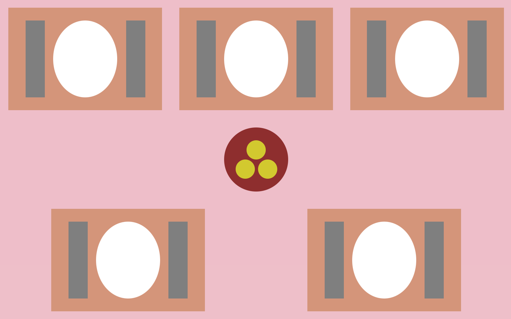

[`React Fundamentals`](../../README.md) > [`Sesión 02: Estado (state) y Propiedades (props)`](../Readme.md) >[`Ejemplo-01`](../Ejemplo-01) > `Reto 1`

## Tía Socorro ganó

### OBJETIVOS:

- Usar componente **stateful (clase)**.
- Convertir de **stateless (funcional)** a **stateful (clase)**.
- Cómo **declarar** y usar el estado en **componente stateful**.

#### REQUISITOS
- Haber completado el [Reto-02](../../Sesion-01/Reto-02) de la Sesion-01.

#### DESARROLLO

1. Abrir nuestro proyecto "Yo me lo llevo!" del [Reto-02](../../Sesion-01/Reto-02) de la Sesion-01.

2. Vamos a hacer que nuestro `Mantel.js` tenga un estado definiendo el color y altura (height) de sí mismo.

3. El ejemplo tendrá el color de `darksalmon` y una altura de `120px`.

4. Resultado:

## ❗Importante

Si no pudiste resolver el reto, no te preocupes,😉 en la parte superior del repositorio encontrarás los archivos con la solución para tu consulta, pero recuerda lo importante es que **lo intentes primero.** 🤓

[`Atrás`](../Ejemplo-01)
