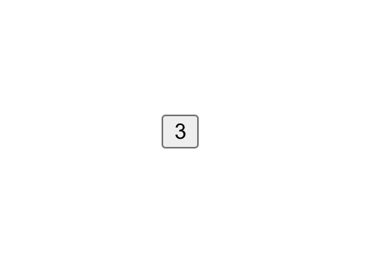

[`React Fundamentals`](../../README.md) > [`Sesión 03: Estado (state) y Propiedades (props)`](../Readme.md) > `Ejemplo 1`

## Incremento

### OBJETIVO
- Modificar el estado.
- Modificar estado del padre por medio de funciones mandadas como props.

#### REQUISITOS 
- Tener Node instalado.

#### DESARROLLO

1. Comenzar nuevo proyecto de React con el comando `npx create-react-app ejemplo1`.

2. Seguir las [buenas prácticas para empezar un proyecto](../../BuenasPracticas/EmpezandoProyectos/Readme.md).

3. Convertimos nuestra `App.js` en un componente stateful (clase) para usar el estado.
```
import React from 'react';

class App extends React.Component {
   render() {
      return (
         <div>
            Hola Mundo!
         </div>
      );
   }
}

export default App;
```

4. Vamos a darle un margen a la aplicación para que no se vea en la mera esquina, creamos una clase CSS y se la ponemos a nuestro `div`.
```
.margen {
   margin: 100px;
}
``` 

5. Creamos un estado y lo imprimimos para ver que funcione bien.
```
import React from 'react';

class App extends React.Component {
   constructor(props) {
      super(props);
      this.state = {
         contador: 0
      };
   }

   render() {
      return (
         <div className="margen">
            {this.state.contador}
         </div>
      );
   }
}

export default App;
``` 

6. Creamos un botón y aseguramos que funcione bien.
```
import React from 'react';

class App extends React.Component {
   constructor(props) {
      super(props);
      this.state = {
         contador: 0
      };
   }

   handleClick = () => alert('pero despacito');

   render() {
      return (
         <div className="margen">
            {this.state.contador}

            <button onClick={this.handleClick}>
               Picame
            </button>
         </div>
      );
   }
}

export default App;
```

7. Si te fijas, estamos usando el evento `click` del navegador. Cuando queramos usar algún evento, tenemos que hacerlo agregando el sufijo `on` seguido del evento y escribirlo en [camel case](https://techterms.com/definition/camelcase).

8. En nuestro caso estamos usando `click` y este se traduce a `onClick`. Si usáramos el `change`, sería `onChange`. Estos son todos los [eventos del navegador](https://www.w3schools.com/jsref/dom_obj_event.asp).

9. Ahora vamos a cambiar el estado del contador cada vez que le demos click en el botón.
```
import React from 'react';

class App extends React.Component {
   constructor(props) {
      super(props);
      this.state = {
         contador: 0
      };
   }

   handleClick = () => {
      this.setState({
         contador: this.state.contador + 1
      })
   }

   render() {
      return (
         <div className="margen">
            {this.state.contador}

            <button onClick={this.handleClick}>
               Picame
            </button>
         </div>
      );
   }
}

export default App;
```

10. Ya logramos cambiar el estado. Si te fijas, `this.setState({})` recibe el nombre del atributo que queramos cambiar con el nuevo valor, que en nuestro caso es `contador: this.state.contador + 1` (lo que valga en ese momento + 1).

11. Ahora vamos a hacer un nuevo componente `Boton.js` el cual va a recibir 2 propiedades (props), recuerda seguir las [buenas prácticas para propiedades](../../BuenasPracticas/PropTypes/Readme.md).
```
import React from 'react';
import PropTypes from 'prop-types';

const Boton = (props) => {
   return (
      <button onClick={props.handleClick}>
         {props.texto}
      </button>
   );
};

Boton.propTypes = {
   texto: PropTypes.string.isRequired,
   handleClick: PropTypes.func.isRequired
}

export default Boton;
```

12. Importamos y vamos a pasarle al `Boton.js` lo que necesite.
```
import React from 'react';
import Boton from './Boton';

class App extends React.Component {
   constructor(props) {
      super(props);
      this.state = {
         contador: 0
      };
   }

   handleClick = () => {
      this.setState({
         contador: this.state.contador + 1
      })
   }

   render() {
      return (
         <div className="margen">
            <Boton
               texto={this.state.contador}
               handleClick={this.handleClick}
            />
         </div>
      );
   }
}

export default App;
```

13. Fíjate como estamos mandando el estado de `App.js` y una función como propiedades. El `<Boton  />` lo único que hace es usar esas propiedades y ya.

14. Cada que le demos click al `<Boton />`, el contador sumará 1.

15. Resultado:


-------

[`Siguiente: Reto-01`](../Reto-01)
