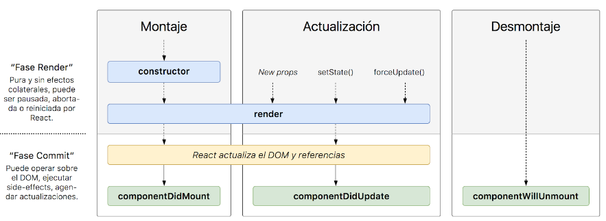

[`Backend Fundamentals`](../../README.md) > [`Sesión 03: Estado (state) y Propiedades (props)`](../Readme.md) > `Prework`

### OBJETIVO
- Introducción de los ciclos de vida: DidMount, WillUnmount, DidUpdate.
- Entender en que momento se ejecuta cada uno.
- Como modificar el estado.
- Entender los eventos.

#### DESARROLLO

## Ciclo de vida de los componentes

Se llama ciclo de vida al tiempo que pasa desde que un objeto **se crea** desde el **código** hasta que se **elimina**. En un nivel un poco más técnico, podríamos decir que desde que se carga en memoria hasta que se elimina de la memoria. Durante la vida de un componente de React, se ejecutan varios métodos, en función del momento.

A estos métodos se les llama métodos del ciclo de vida. Algunos **métodos del ciclo de vida** que ya conocemos son el **constructor()**, que se ejecuta, solo una vez, cuando se crea el componente, y **render()**, que sabemos que se ejecuta en algún momento después de crearse y cada vez que cambia el estado.

**Podemos clasificar los métodos del [**ciclo de vida**](https://projects.wojtekmaj.pl/react-lifecycle-methods-diagram/) en tres tipos:**

+ **De montaje:** Los que se ejecutan en la fase de creación del componente.
+ **De actualización:** Los que se ejecutan mientras el componente vive.
+ **De desmontaje:** Los que se ejecutan antes de que el componente se destruya.

### Montaje de un componente

El montaje es la primera fase del ciclo de vida de un componente. Es la parte en la que se **crea el componente**. Sabemos que un componente de React representa un elemento del DOM y lo que contiene. En el momento en que ese elemento se pinta en el DOM, aparece visualmente en la página web, decimos que ese componente está montado. Como ya sabemos que el **método render()** es el encargado de pintar el componente, podemos decirlo de otra manera: un componente se monta en el momento en que se ejecuta su **render()** por primera vez.

Sin perder de vista la primera ejecución de **render()**, que nos servirá de referencia, vamos a ver el resto de métodos de la fase de montaje en orden de ejecución:

+ **constructor():** este ya lo conocemos. Se ejecuta según se crea el componente por código y se le pasan las props iniciales. **Aquí:**
  * inicializamos el estado
  * enlazamos los event handlers a la instancia con .bind(this)

+ **render():** otro viejo amigo.
devolvemos lo que se pinta en función de props y state

+ **componentDidMount():** literalmente, "el componente se ha montado". Este método se ejecuta justo después de que el componente se haya montado (pintado en pantalla).
  + podemos pedir datos remotos, con **fetch()**, por **ejemplo**
  podemos "suscribir" el componente, por ejemplo, a un **setInterval()** u otro código que nos dé datos de manera periódica o de tanto en tanto.

### Desmontaje de un componente

Si el montaje es la primera fase del ciclo de vida de un componente, el desmontaje es la **última fase** del ciclo de vida del componente. Es la parte en la que se va a **destruir el componente**, va a dejar de mostrarse en pantalla y de existir en memoria.
Esta fase solo tiene un método: el método **componentWillUnmount()** (el componente se va a desmontar). En este método limpiaremos todo lo residual que pueda dejar nuestro componente una vez no exista. Podemos pensarlo como la contraparte de **componentDidMount()**, porque será aquí donde debemos dar de baja las suscripciones que hayamos iniciado allí.
Si no se limpia lo residual del componente, nos aparecerán errores de partes del código que intentan acceder a un componente que ya no existe.

**Actualización de un componente**

Como ya sabemos, mientras un componente está montado, si cambian las **props** o el **estado**, el componente se vuelve a **renderizar**. Esto ocurre siempre por defecto. Sin embargo, con los métodos del ciclo de vida podemos adaptar esto a nuestras necesidades: podremos hacer operaciones en distintos puntos de la actualización o hasta impedir que el componente se re-renderice si se dan unas condiciones.
Estos métodos son paralelos a los métodos del montaje del componente.

+ **shouldComponentUpdate():** decide si el componente se actualiza visualmente; es decir si los dos métodos siguientes se ejecutan o no:
+ **render():** siempre puro y fiel
+ **componentDidUpdate(prevProps, prevState):** similar a **componentDidMount()**, se llama justo después de re-renderizar un componente por actualización de sus props o estado. Si el componente hace peticiones que dependen de una prop, este es buen lugar para rehacerlas, después de comprobar que efectivamente esa prop en concreto ha cambiado.

### Actualización: evitar re-renderizar un componente

En la fase de actualización del ciclo de vida, tenemos el método **shouldComponentUpdate**(nextProps, nextState) **¿debe el componente actualizarse?.**
Este método debe devolver un booleano. Si se devuelve un booleano false, entonces no se ejecutarán ni **render()**, ni **componentDidUpdate().**

En este método podremos comparar los cambios entre las props y el estado actuales (this.props y this.state) con las props y el estado que se van a recibir (nextProps y nextState) para decidir si queremos que se repinte el componente o no.
Este método no se llama cuando se llama a **forceUpdate().**

**Recursos:**

1. [**Estado y ciclo de vida**](https://es.reactjs.org/docs/state-and-lifecycle.html).

2. [**Manejando eventos**](https://es.reactjs.org/docs/handling-events.html).

3. [**Listas y keys**](https://es.reactjs.org/docs/lists-and-keys.html).
