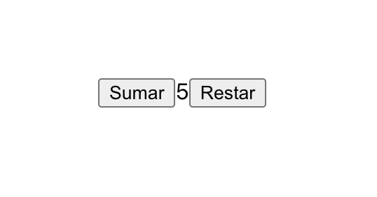

[`React Fundamentals`](../../README.md) > [`Sesión 03: Estado (state) y Propiedades (props)`](../Readme.md) >[`Ejemplo-01`](../Ejemplo-01) > `Reto 1`

## Incremento y decremento

### OBJETIVO
- Modificar el estado.
- Modificar estado del padre por medio de funciones mandadas como props.

#### REQUISITOS 
- Tener Node instalado.
- Completar el [Ejemplo-01](../Ejemplo-01)

#### DESARROLLO

1. Abrir nuestro proyecto "Incremento" del [Ejemplo-01](../Ejemplo-01).

2. Debemos de tener 2 botones, uno para sumar y otro para restar.

3. Resultado:

## ❗Importante

Si no pudiste resolver el reto, no te preocupes,😉 en la parte superior del repositorio encontrarás los archivos con la solución para tu consulta, pero recuerda lo importante es que **lo intentes primero.** 🤓

[`Atrás`](https://github.com/beduExpert/C1-React-2020/tree/master/Sesion-03/Ejemplo-01)
