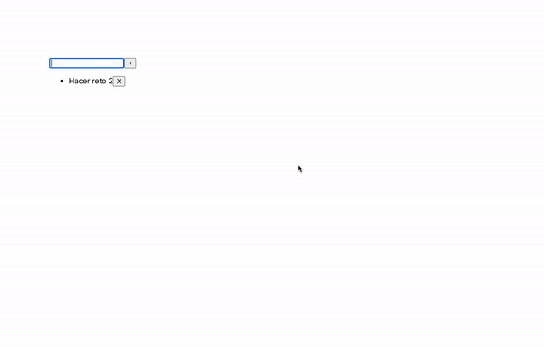

[`React Fundamentals`](../../README.md) > [`Sesión 03: Estado (state) y Propiedades (props)`](../Readme.md) >[`Ejemplo-02`](../Ejemplo-02) > `Reto 2`

## Ciclos de vida viejos

### OBJETIVO
- Modificar el estado.
- Modificar estado del padre por medio de funciones mandadas como props.
- Introducción de los ciclos de vida: DidMount, WillUnmount, DidUpdate.
- Entender en que momento se ejecuta cada uno.
- Usar los eventos onClick y onChange.

#### REQUISITOS 
- Tener Node instalado.
- Completar el [Ejemplo-02](../Ejemplo-02).

#### DESARROLLO

1. Comenzar nuevo proyecto de React con el comando `npx create-react-app reto2`.

2. Seguir las [buenas prácticas para empezar un proyecto](../../BuenasPracticas/EmpezandoProyectos/Readme.md).

3. Hacer una app de tareas por hacer, en donde agreguemos y eliminemos tareas.

4. Avisar si la tarea ya existe.

5. No olvides seguir las [buenas prácticas para las propiedades (props)](../../BuenasPracticas/PropTypes/Readme.md).

6. Resultado:

## ❗Importante

Si no pudiste resolver el reto, no te preocupes,😉 en la parte superior del repositorio encontrarás los archivos con la solución para tu consulta, pero recuerda lo importante es que **lo intentes primero.** 🤓

[`Atrás`](https://github.com/beduExpert/C1-React-2020/tree/master/Sesion-03/Ejemplo-02)
