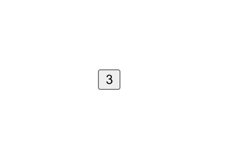

[`React Fundamentals`](../../README.md) > [`Sesión 04: Hooks y useState`](../Readme.md) > `Ejemplo 1`

## Incrementando de nuevo

### OBJETIVO
- De componente stateful (clase) a hook.

#### REQUISITOS 
- Tener Node instalado.

#### DESARROLLO

1. Vamos a rehacer el [Ejemplo-01](../../Sesion-03/Ejemplo-01) de la Sesion-03 pero ahora usando hooks.

2. Comenzar nuevo proyecto de React con el comando `npx create-react-app ejemplo1`.

3. Seguir las [buenas prácticas para empezar un proyecto](../../BuenasPracticas/EmpezandoProyectos/Readme.md).

4. Vamos a dejar `App.js` como un componente stateless (funcional) y de todas formas usaremos estado en pasos siguientes.
```
import React from 'react';

const App = () => {
   return (
      <div>
         Hola Mundo!
      </div>
   );
};

export default App;
```

5. Vamos a darle un margen a la aplicación para que no se vea en la mera esquina, creamos una clase CSS y se la ponemos a nuestro `div`.
```
.margen {
   margin: 100px;
}
``` 

6. Creamos un estado y lo imprimimos para ver que funcione bien. ATENCIÓN a la nueva forma de crear estados con hooks.
```
import React from 'react';

const App = () => {
   const [contador, setContador] = React.useState(0);

   return (
      <div className="margen">
         {contador}
      </div>
   );
};

export default App;
``` 

7. Estamos destructurando de la variable tal cual `contador` y la función para modificarla `setContador` y le estamos dando un valor inicial de `0` dentro del `React.useState()`.

8. Creamos un botón y ponemos el contador adentro.
```
import React from 'react';

const App = () => {
   const [contador, setContador] = React.useState(0);

   return (
      <div className="margen">
         <button>
            {contador}
         </button>
      </div>
   );
};

export default App;
```

9. Ahora vamos a cambiar el estado del contador cada vez que le demos click en el botón.
```
import React from 'react';

const App = () => {
   const [contador, setContador] = React.useState(0);

   const handleClick = () => {
      setContador(contador + 1);
   };

   return (
      <div className="margen">
         <button onClick={handleClick}>
            {contador}
         </button>
      </div>
   );
};

export default App;
```

10. Ya logramos cambiar el estado. Si te fijas, `setContador()` recibe el número del nuevo valor, que en nuestro caso es `contador + 1` (lo que valga en ese momento + 1).

11. Ahora vamos a hacer un nuevo componente `Boton.js` el cual va a recibir 2 propiedades (props), recuerda seguir las [buenas prácticas para propiedades](../../BuenasPracticas/PropTypes/Readme.md).
```
import React from 'react';
import PropTypes from 'prop-types';

const Boton = (props) => {
   return (
      <button onClick={props.handleClick}>
         {props.texto}
      </button>
   );
};

Boton.propTypes = {
   texto: PropTypes.string.isRequired,
   handleClick: PropTypes.func.isRequired
}

export default Boton;
```

12. Importamos y vamos a pasarle al `Boton.js` lo que necesite.
```
import React from 'react';
import Boton from './Boton';

const App = () => {
   const [contador, setContador] = React.useState(0);

   const handleClick = () => {
      setContador(contador + 1);
   };

   return (
      <div className="margen">
         <Boton
            texto={contador}
            handleClick={handleClick}
         />
      </div>
   );
};

export default App;
```

13. Fíjate como estamos mandando el estado de `App.js` y una función como propiedades. El `<Boton  />` lo único que hace es usar esas propiedades y ya.

14. Cada que le demos click al `<Boton />`, el contador sumará 1.

15. Resultado:


-------

[`Siguiente: Reto-01`](../Reto-01)
