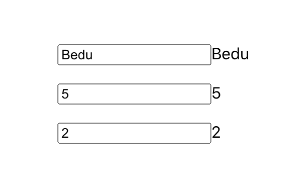

[`React Fundamentals`](../../README.md) > [`Sesión 04: Hooks y useState`](../Readme.md) > `Ejemplo 3`

## Escuela

### OBJETIVO
- Usando useState para creación y modificación de estado (state).

#### REQUISITOS 
- Tener Node instalado.

#### DESARROLLO

1. Comenzar nuevo proyecto de React con el comando `npx create-react-app ejemplo3`.

2. Seguir las [buenas prácticas para empezar un proyecto](../../BuenasPracticas/EmpezandoProyectos/Readme.md).

3. Vamos a darle un margen a la aplicación para que no se vea en la mera esquina, creamos una clase CSS y se la ponemos a nuestro `div`.
```
.margen {
   margin: 100px;
}
``` 

4. Vamos a aprender una forma nueva de usar el estado, será parecida a como la usabamos con los componentes stateful (clase).

5. Creamos el estado `nombre` de la forma como conocemos.
```
import React from 'react';

const App = () => {
   const [nombre, setNombre] = React.useState('')

   return (
      <div className="margen">
         Hola Mundo!
      </div>
   );
};

export default App;
``` 

6. Y ahora vamos a agregar otros estados en una sola declaración (recuerda que podemos tener tantos `React.useState` como queramos).
```
import React from 'react';

const App = () => {
   const [nombre, setNombre] = React.useState('')
   const [state, setState] = React.useState({
      profes: 0,
      alumnos: 0
   });

   return (
      <div className="margen">
         Hola Mundo!
      </div>
   );
};

export default App;
```

7. Si te fijas, estamos tratando el estado parecido como lo haciamos antes, llamandolo `state` y la función para editarlo se llama `setState`.

8. Vamos a crear un campo de texto para cada uno e imprimir el valor para los 3 estados que tenemos (nombre, profes y alumnos).

9. Observa la diferencia de como usar el estado en las 2 maneras diferentes.
```
import React from 'react';

const App = () => {
   const [nombre, setNombre] = React.useState('')
   const [state, setState] = React.useState({
      profes: 0,
      alumnos: 0
   });

   return (
      <div className="margen">
         <input />
         {nombre}
         <br /><br />

         <input type="number" />
         {state.profes}
         <br /><br />

         <input type="number" />
         {state.alumnos}
         <br /><br />
      </div>
   );
};

export default App;
```

10. Vamos a crear la función para cambiar el estado del nombre.
```
import React from 'react';

const App = () => {
   const [nombre, setNombre] = React.useState('')
   const [state, setState] = React.useState({
      profes: 0,
      alumnos: 0
   });

   const editarNombre = (event) => setNombre(event.target.value);

   return (
      <div className="margen">
         <input onChange={editarNombre} />
         {nombre}
         <br /><br />

         <input type="number" />
         {state.profes}
         <br /><br />

         <input type="number" />
         {state.alumnos}
         <br /><br />
      </div>
   );
};

export default App;
```

11. Ahora vamos a crear una función ESPECÍFICA para cambiar solo a los profes.
```
import React from 'react';

const App = () => {
   const [nombre, setNombre] = React.useState('')
   const [state, setState] = React.useState({
      profes: 0,
      alumnos: 0
   });

   const editarNombre = (event) => setNombre(event.target.value);
   const editarProfes = (event) => setState({
      ...state,
      profes: event.target.value
   });

   return (
      <div className="margen">
         <input onChange={editarNombre} />
         {nombre}
         <br /><br />

         <input type="number" onChange={editarProfes} />
         {state.profes}
         <br /><br />

         <input type="number" />
         {state.alumnos}
         <br /><br />
      </div>
   );
};

export default App;
```

12. En este ejemplo tomamos la decisión de usar un `state` como un objeto contenedor de estados, y como solo guarda 2 valores podríamos crear una función para cada uno sin problema. Pero si nuestro `state` llegara a usar 100 valores, crearíamos 100 funciones? La respuesta es SI.

13. No te creas, ni de chiste.

14. Ahora vamos a crear una función GENÉRICA para cambiar nuestro `state` y la usamos con los alumnos.
```
import React from 'react';

const App = () => {
   const [nombre, setNombre] = React.useState('')
   const [state, setState] = React.useState({
      profes: 0,
      alumnos: 0
   });

   const editarNombre = (event) => setNombre(event.target.value);
   const editarProfes = (event) => setState({
      ...state,
      profes: event.target.value
   });
   const editarState = (atributo) => (event) => setState({
      ...state,
      [atributo]: event.target.value
   });

   return (
      <div className="margen">
         <input onChange={editarNombre} />
         {nombre}
         <br /><br />

         <input type="number" onChange={editarProfes} />
         {state.profes}
         <br /><br />

         <input type="number" onChange={editarState('alumnos')} />
         {state.alumnos}
         <br /><br />
      </div>
   );
};

export default App;
```

15. La función `editarState` no es sencilla, probablemente tengamos muchas dudas de cómo funciona. Aprovecha a esa persona hermosa y capáz que tienes como profe y preguntale lo que no entiendas.

16. Como esta nueva función es genérica para cualquier atributo de `state`, significa que podemos cambiar nuestra forma de editar a los profes, vamos a hacerlo.
```
<input type="number" onChange={editarState('profes')} />
{state.profes}
<br /><br />
```

17. Vamos a dejar la función de `editarProfes` (aunque ya no se use) para recordar en el futuro que se puede hacer de otra manera.

18. Resultado:


-------

[`Siguiente: Reto-03`](../Reto-03)
