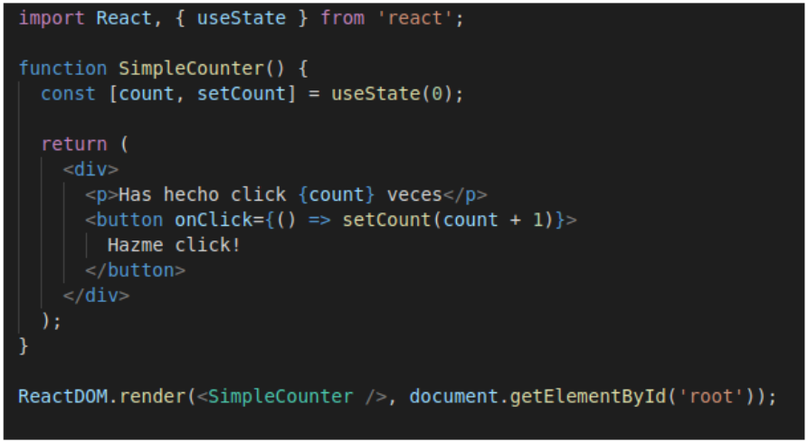

[`Backend Fundamentals`](../../README.md) > [`Sesión 03: Hooks y useState`](../Readme.md) > `Prework`

### OBJETIVO
- Introducción de los hooks.
- Porqué usarse y ventajas.
- De componente stateful (clase) a hook.

#### DESARROLLO

## Hooks y useState

>💡 **Nota:**
>
>**En la versión de React 16.8.0, ¡ya están disponibles los Hooks!.**

La palabra **Hook** se traduce como **Gancho** en español, y la razón de que esta **nueva API** tenga este nombre, es que como indica la documentación, un Hook en react te permite **colgarte** o si buscáramos una mejor traducción sería algo como integrarte con el **manejo de estado** y los **métodos del ciclo de vida de un componente**, desde un componente funcional.

Hasta el día de hoy, los componentes clase poseían habilidades que los componentes funcionales no tenían, principalmente la habilidad de conservar un estado, y la habilidad de definir acciones a realizar en el ciclo de vida de un componente, vía los métodos **componentDidMount**, **componentDidUpdate** entre otros más.

Los **hooks**, proveen de una **API** que permite a los componentes funcionales **manejar un estado**, y definir **lógica** para el **ciclo de vida de un componente**.

## Por qué los hooks

Como explica **sophie Alpert**  en su presentación durante la **ReactConf 2018**, existen **3 problemas** que el equipo de React está buscando solucionar con los Hooks:

+ **Compartir y reutilizar** lógica entre componentes
+ **Reducir** el tamaño de componentes muy complejos
+ **Eliminar** la confusión que las clases generan.
Estos son problemas identificados por la comunidad, en pocas palabras es **complicado reciclar lógica entre componentes**, algunos componentes pueden volverse **verbosos** y terminar conteniendo miles de líneas de código, y las clases no son tan amigables como pensábamos, son complicadas de entender para algunos programadores, especialmente por algunas características que las hacen particulares en JavaScript, y además, son complejas para algunas tareas de las computadoras como la optimización de código, minificación, etc.

Y aunque estos parezcan problemas independientes, Dan Abramov explica que en realidad son problemas que están relacionados entre sí y que seguramente dar solución a uno, puede significar dar solución a los 3. **Aquí entran los Hooks**.

**A continuación te dejamos el video del lanzamiento de React**

[](http://www.youtube.com/watch?v=dpw9EHDh2bM "https://miro.medium.com/max/3600/1*HSisLuifMO6KbLfPOKtLow.jpeg")

Además del hook de **manejo de estado**, React tiene otros hooks entre los que **destacan**:

+ useEffect
+ useContext
+ useReducer

Entre muchos otros que puedes encontrar [**aquí**](https://reactjs.org/docs/hooks-reference.html):

## El hook de estado: useState

El hook **useState** es el que nos permite **agregarle** un **estado local** a un componente funcional y cambiar ese estado.

**Ejemplo:**

Para que un componente funcional tenga estado propio podemos hacer uso del **hook useState**.

```jsx
import React, { useState } from 'react';
```

**useState()** es una **función** que crea internamente una variable donde podremos almacenar el estado de nuestro componente. Acepta un **valor inicial** para esa **variable** y **devuelve** un **array con dos elementos, el valor de la variable y la función para modificarla.**
Como el valor devuelto por la **función** es un **array**, podemos descomponerlo para acceder a sus elementos de manera individual.

```jsx
const [count, setCount] = useState(0);
```

**Te dejamos un ejemplo práctico:**



Puedes añadir tantos **useState()** como quieras, cada uno de ellos para una **variable** diferente.
La única **condición** es que se llame desde un nivel **superior** de **código**, no en un **bloque**.
Es importante saber que cuando **llamamos** a la **función** set de un **useState**(), se **sobrescribe** el contenido de la variable.

**Recursos:**

1. [**Presentando Hooks**](https://es.reactjs.org/docs/hooks-intro.html).

2. [**Usando el Hook de estado**](https://es.reactjs.org/docs/hooks-state.html).
