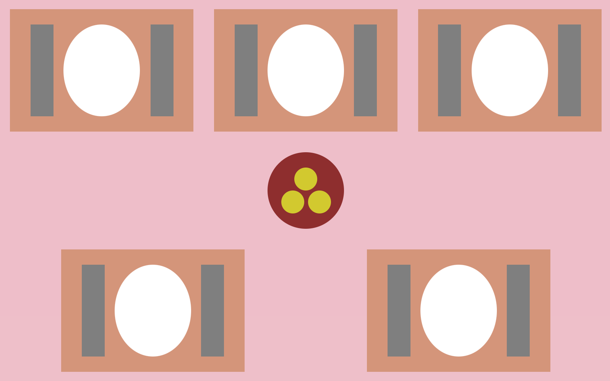

[`React Fundamentals`](../../README.md) > [`Sesión 02: Sesión 04: Hooks y useState`](../Readme.md) >[`Ejemplo-02`](../Ejemplo-02) > `Reto 2`

## ¡Pero quiere otro!

### OBJETIVO
- De componente stateful (clase) a hook.

#### REQUISITOS
- Haber completado el [Reto-01](../../Sesion-02/Reto-01) de la Sesion-02.

#### DESARROLLO

1. Abrir nuestro proyecto "Tía Socorro ganó" del [Reto-01](../../Sesion-02/Reto-01) de la Sesion-02.

2. Vamos a convertir nuestro componente `Mantel.js` de stateful (clase) a hooks.

3. Resultado:

## ❗Importante

Si no pudiste resolver el reto, no te preocupes,😉 en la parte superior del repositorio encontrarás los archivos con la solución para tu consulta, pero recuerda lo importante es que **tú lo intentes primero.** 🤓

[`Atrás`](https://github.com/beduExpert/C1-React-2020/tree/master/Sesion-04/Ejemplo-02)
