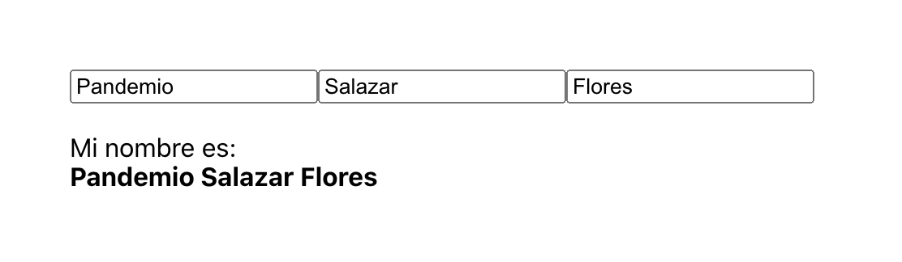

[`React Fundamentals`](../../README.md) > [`Sesión 02: Sesión 04: Hooks y useState`](../Readme.md) >[`Ejemplo-03`](../Ejemplo-03) > `Reto 3`

## ¿Cómo te llamas?

### OBJETIVO
- Usando useState para creación y modificación de estado (state).

#### REQUISITOS 
- Tener Node instalado.

#### DESARROLLO

1. Comenzar nuevo proyecto de React con el comando `npx create-react-app reto3`.

2. Seguir las [buenas prácticas para empezar un proyecto](../../BuenasPracticas/EmpezandoProyectos/Readme.md).

3. Vamos a darle un margen a la aplicación para que no se vea en la mera esquina, creamos una clase CSS y se la ponemos a nuestro `div`.
```
.margen {
   margin: 100px;
}
``` 

4. Pongámos 3 campos de texto en el cual podamos escribir nuestro nombre completo y desplegarlo.

5. El estado deberá de ser usado de la siguiente manera:
```
const [state, setState] = React.useState({
   nombre: '',
   apellidos: [
      '',   // Materno
      ''    // Paterno
   ]
});
``` 

6. Cambia los estados usando máximo 2 funciones para todos los atributos.

7. Recuerda que es MUUUUY importante hacer copias del estado si vas a cambiar cosas antes del `useState`, esto para seguir la regla de inmutabilidad.

8. Resultado:


## ❗Importante

Si no pudiste resolver el reto, no te preocupes,😉 en la parte superior del repositorio encontrarás los archivos con la solución para tu consulta, pero recuerda lo importante es que **tú lo intentes primero.** 🤓

[`Atrás`](https://github.com/beduExpert/C1-React-2020/tree/master/Sesion-04/Ejemplo-03)
