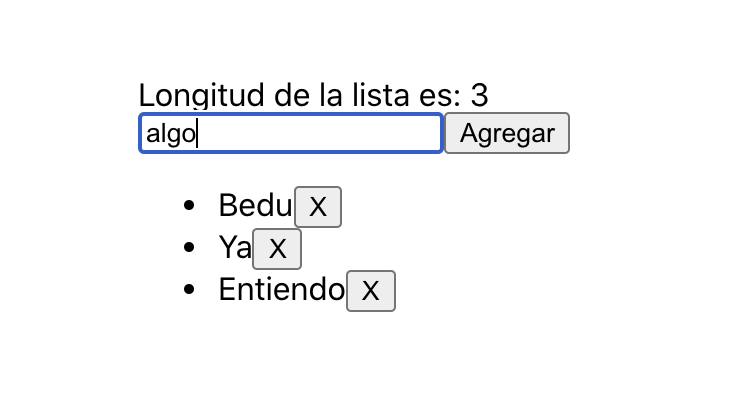

[`React Fundamentals`](../../README.md) > [`Sesión 05: Hooks y useEffect`](../Readme.md) > `Ejemplo 1`

## Capitán Garfio

### OBJETIVO
- Convertir los 3 ciclos de vida a hooks.

#### REQUISITOS
- Haber completado el [Ejemplo-02](../../Sesion-03/Ejemplo-02) de la Sesion-03.

#### DESARROLLO

1. Abrir nuestro proyecto "Complejidad, bienvenida" del [Ejemplo-02](../../Sesion-03/Ejemplo-02) de la Sesion-03.

2. Vamos a abrir primero `Nombre.js` y lo modificaremos para que ahora use los hooks de useEffect.

3. Si vemos, estamos usando 2 ciclos de vida, el `componentDidMount` y `componentWillUnmount`, vamos a comentar los 2 para que nos quede de esta manera:
```
import React from 'react';
import PropTypes from 'prop-types';

class Nombre extends React.Component {
   // componentDidMount() {
   //    alert('Te damos la bienvenida ' + this.props.nombre);
   // }

   // componentWillUnmount() {
   //    alert('Adiós');
   // }

   render() {
      return (
         <div>
            {this.props.nombre}
            <button onClick={this.props.borrarNombreDeLista}>
               X
            </button>
         </div>
      );
   }
};

Nombre.propTypes = {
   nombre: PropTypes.string.isRequired,
   borrarNombreDeLista: PropTypes.func.isRequired
}

export default Nombre;
``` 

4. Como primer paso para migrar de stateful (clase) a hook, es hacerlo stateless (funcion), espero que te acuerdes de como hacerlo.

5. Primero cambiamos la línea de declaración a `const Nombre = (props) => {`; y MUUUCHO cuidado, como en este caso estamos usando propiedades (props) no se nos debe olvidar incluir el `props` en la declaración.
```
const Nombre = (props) => {
   // componentDidMount() {
   //    alert('Te damos la bienvenida ' + this.props.nombre);
   // }

   // componentWillUnmount() {
   //    alert('Adiós');
   // }

   render() {
      return (
         <div>
            {this.props.nombre}
            <button onClick={this.props.borrarNombreDeLista}>
               X
            </button>
         </div>
      );
   }
};
``` 

6. Sacamos el `return` del `render`.
```
const Nombre = (props) => {
   // componentDidMount() {
   //    alert('Te damos la bienvenida ' + this.props.nombre);
   // }

   // componentWillUnmount() {
   //    alert('Adiós');
   // }

   return (
      <div>
         {this.props.nombre}
         <button onClick={this.props.borrarNombreDeLista}>
            X
         </button>
      </div>
   );
};
```

7. Y finalmente cambiamos todos los `this.props` por solo `props`. Ya vuelve a funcionar la app.
```
const Nombre = (props) => {
   // componentDidMount() {
   //    alert('Te damos la bienvenida ' + this.props.nombre);
   // }

   // componentWillUnmount() {
   //    alert('Adiós');
   // }

   return (
      <div>
         {props.nombre}
         <button onClick={props.borrarNombreDeLista}>
            X
         </button>
      </div>
   );
};
```

8. Vamos a crear nuestro primer `useEffect` sin parámetros para que veamos cómo y cuándo funciona.
```
const Nombre = (props) => {
   // componentDidMount() {
   //    alert('Te damos la bienvenida ' + this.props.nombre);
   // }

   React.useEffect(() => {
      console.log('Dentro de useEffect');
   });

   // componentWillUnmount() {
   //    alert('Adiós');
   // }

   return (
      <div>
         {props.nombre}
         <button onClick={props.borrarNombreDeLista}>
            X
         </button>
      </div>
   );
};
```

9. Ahora abre la consola del navegador y juega con la app; escribe, agrega, elimina, hazla tuya.

10. Cada vez que cualquier estado es modificado (en este caso en `App.js`), el `useEffect` se ejecuta.

11. No es lo que necesitamos, porque queremos hacer un `componentDidMount`. Para poder lograr esto es muy sencillo.

12. Al `useEffect` le vamos a agregar `[]`.
```
React.useEffect(() => {
   console.log('Dentro de useEffect');
}, []);
```

13. Ahora funciona igualito al `componentDidMount`. Esto esta pasando porque le dijimos al `useEffect` que reaccione solamente cuando los parámetros que le mandamos cambien; y como le mandamos un arreglo vacio `[]` (sin parámetros), el `useEffect` solo se ejecutará una sola vez cuando el componente sea montado (`componentDidMount`).

14. Con el texto anterior también se puede deducir que el `useEffect` siempre va a correr como `componentDidMount`. Y es correcto, cada `useEffect` que tengamos, va a correr mínimo una vez como `componentDidMount`.

15. Hasta ahorita ya vimos como podemos hacer que reaccione a cada cambio de cualquier estado o solo cuando se monta el componente; ahora vamos a replicar el `componentWillUnmount`.

16. Dentro del `useEffect` que ya tenemos, vamos a agregarle una función de retorno.
```
React.useEffect(() => {
   console.log('Dentro de useEffect');
   return () => {
      console.log('Replicando willUnmount');
   }
}, []);
```

17. ¡Ahora ya tenemos listo nuestro `componentDidMount` y `componentWillUnmount` hechos con hooks!

18. Vamos a pasar el código que comentamos a los hooks, pero en lugar de `alert` lo dejamos como `console.log`.
```
import React from 'react';
import PropTypes from 'prop-types';

const Nombre = (props) => {
   React.useEffect(() => {
      console.log('Te damos la bienvenida ' + props.nombre);
      return () => {
         console.log('Adiós');
      }
   }, []);

   return (
      <div>
         {props.nombre}
         <button onClick={props.borrarNombreDeLista}>
            X
         </button>
      </div>
   );
};

Nombre.propTypes = {
   nombre: PropTypes.string.isRequired,
   borrarNombreDeLista: PropTypes.func.isRequired
}

export default Nombre;
```

19. Ahora si te fijas en la consola del navegador, vas a ver una alerta parecida a `React Hook React.useEffect has a missing dependency: 'props.nombre'`. Esto pasa porque dentro del `useEffect` estamos usando `props.nombre` y quiere que se lo pasemos como parámetro dentro del arreglo `[]`. Para este punto ya debes de saber que pasa si lo agregamos ahí adentro. Sí, ese `useEffect` ahora reaccionaría cuando `props.nombre` cambie, que en este caso nunca va a pasar. PEEEERO, para evitarnos futuros errores a nosotros mismos o a otros desarrolladores, vamos a dejar las cosas bien hechas. Por que así somos nosotros, a toda mdr (madera).

20. Por la misma razón de la madera, también debemos evitar tener alertas en la consola del navegador. Aquí es cuando te recomiendo seguir las [buenas prácticas para `useEffect`](../../BuenasPracticas/useEffect/Readme.md). Esto es opcional pero recomendado.

21. Para este caso se siguió la recomendación de hacerlo por ciclo de vida solamente para mostrarte que podemos tener varios `useEffect`. Si lo hiciste de otra manera esta bien.
```
const Nombre = (props) => {
   const didMount = () => {
      console.log('Te damos la bienvenida ' + props.nombre);
   };
   React.useEffect(didMount, []);

   const willUnmount = () => {
      return () => {
         console.log('Adiós');
      }
   };
   React.useEffect(willUnmount, []);

   return (
      <div>
         {props.nombre}
         <button onClick={props.borrarNombreDeLista}>
            X
         </button>
      </div>
   );
};
```

22. Hasta ahorita ya sabemos que podemos:
   - Pasar de stateful (clase) a stateless (función).
   - Usar `useState` para los estados ([Sesion-04](../../Sesion-04)).
   - Recrear los ciclos de vida con hooks.
   - Tener los `useEffect` que quieras.

23. Ahora vamos a hacer lo mismo con un componente mas extenso, `App.js`.

24. Comenta el `componentDidUpdate`, convierte de stateful a stateless, usa `useState`, y arregla todo lo necesario para que funcione la app.

25. Ya deberías poder hacer todo esto solo; si aún no lo logras, ponte a repasar o toma medidas para que no te quedes atras.
```
import React from 'react';
import Nombre from './Nombre';

const App = () => {
   const [state, setState] = React.useState({
      nombre: '',
      mensaje: '',
      listaNombres: ['Bedu']
   })

   // componentDidUpdate(prevProps, prevState) {
   //    if (state.listaNombres !== prevState.listaNombres) {
   //       setState({
   //          mensaje: `Longitud de la lista es: ${state.listaNombres.length}`
   //       })
   //    }
   // };

   const handleInputChange = (event) => {
      setState({
         ...state,
         nombre: event.target.value
      });
   };

   const handleClick = () => {
      const nombreEnEstado = state.nombre;
      if (!nombreEnEstado) return;

      const listaActualizada = [
         ...state.listaNombres,
         nombreEnEstado
      ];

      setState({
         ...state,
         nombre: '',
         listaNombres: listaActualizada,
      });
   };

   const borrarNombreDeLista = (key) => {
      const copiaDeLista = [...state.listaNombres];
      copiaDeLista.splice(key, 1);

      setState({
         ...state,
         listaNombres: copiaDeLista
      });
   };

   return (
      <div className="margen">
         {state.mensaje}
         <br />
         <input
            value={state.nombre}
            onChange={handleInputChange}
         />
         <button onClick={handleClick}>
            Agregar
         </button>

         <ul>
            {state.listaNombres.map((nmbr, key) => (
               <li key={key}>
                  <Nombre
                     nombre={nmbr}
                     borrarNombreDeLista={() => borrarNombreDeLista(key)}
                  />
               </li>
            ))}
         </ul>
      </div>
   );
}

export default App;
```

26. Ahora vamos a aprender un `useEffect` nuevo, para el `componentDidUpdate`. Probablemente ya tengas una idea de como es o ya hasta lo hiciste.

27. Sí, solo añadimos la dependencia en el arreglo `[]`.
```
React.useEffect(() => {
   setState({
      ...state,
      mensaje: `Longitud de la lista es: ${state.listaNombres.length}`
   });
}, [state.listaNombres]);
```

28. Recuerda seguir las [buenas prácticas para `useEffect`](../../BuenasPracticas/useEffect/Readme.md) para eliminar la alerta de la consola.
```
const didUpdate = () => {
   setState({
      ...state,
      mensaje: `Longitud de la lista es: ${state.listaNombres.length}`
   });
};
React.useEffect(didUpdate, [state.listaNombres]);
```

29. Ahora este nuevo `useEffect` se ejecutará cada vez que el componente se monte y cada que `state.listaNombres` cambie.

30. Resultado


-------

[`Siguiente: Reto-01`](../Reto-01)
