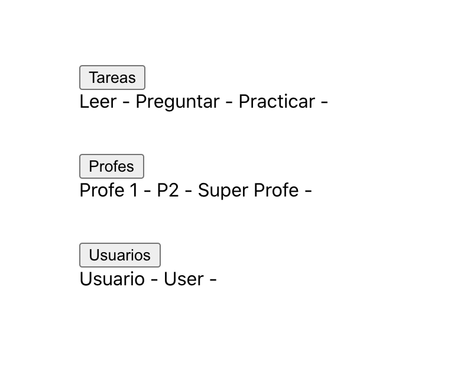

[`React Fundamentals`](../../README.md) > [`Sesión 05: Hooks y useEffect`](../Readme.md) > `Ejemplo 2`

## Simulando llamadas condicionales

### OBJETIVO
- Usando useEffect.
- Renderizado condicional.

#### REQUISITOS 
- Tener Node instalado.

#### DESARROLLO

1. Comenzar nuevo proyecto de React con el comando `npx create-react-app ejemplo2`.

2. Seguir las [buenas prácticas para empezar un proyecto](../../BuenasPracticas/EmpezandoProyectos/Readme.md).

3. Vamos a darle un margen a la aplicación para que no se vea en la mera esquina, creamos una clase CSS y se la ponemos a nuestro `div`.
```
.margen {
   margin: 100px;
}
``` 

4. Primero vamos a hacer que un componente se monto dependiendo de una condición.

5. Creamos un estado de `mostrarUsuarios` como `false`.
```
import React from 'react';

const App = () => {
   const [mostrarUsuarios, setMostrarUsuarios] = React.useState(false);

   return (
      <div className="margen">
         Hola Mundo!
      </div>
   );
};

export default App;
``` 

6. Vamos a ver 3 maneras de renderizado condicional.
   - Directa
   - Ternaria
   - Por función

7. Directa - tratamos a la condición y al componente como si estuvieran adentro de un `if`.
```
import React from 'react';

const App = () => {
   const [mostrarUsuarios, setMostrarUsuarios] = React.useState(false);

   const componente = <span>Hola Mundo!</span>;

   return (
      <div className="margen">
         {mostrarUsuarios && componente}
      </div>
   );
};

export default App;
```

8. El código de arriba no va a mostrar nada en pantalla porque `mostrarUsuarios` esta en falso, pero si lo cambias a `true`, va a desplegar el componente.

9. Primero se asegura que `mostrarUsuarios` sea verdadero; en dado caso que no lo sea, termina la condición y no llega al componente. Cuando sí es verdadero, llega al componente, verifica que exista (sí existe en este caso) y como es la última condición que hay, la imprime.

10. Se recomienda usar este tipo de renderizado con solo una condición, igual como lo tenemos. En otras palabras, verificar si algo es verdadero o falso y después renderizar algún componente.
```
{condicionParaRevisar && componenteParaRenderizar}
```

11. Ternaria - puede ser usada para renderizar 2 componentes dependiendo la condición.
```
import React from 'react';

const App = () => {
   const [mostrarUsuarios, setMostrarUsuarios] = React.useState(false);

   const componente = <span>Hola Mundo!</span>;
   const noHay = 'No hay nada';

   return (
      <div className="margen">
         {mostrarUsuarios ? componente : noHay}
      </div>
   );
};

export default App;
```

12. En este ejemplo se renderiza `componente` cuando la condición es verdadera pero tambien renderizamos algo más cuando es falsa; en este caso, renderizamos `noHay`.

13. Ya sabemos 2 maneras de imprimir directamente en el `return` del componente, pero puede pasar que necesitemos tener diferentes condiciones o hacer varias declaraciones para poder tomar una decisión al imprimir. Para eso esta la última manera.

14. Por función - llamamos una función y retornamos lo que queramos imprimir.
```
import React from 'react';

const App = () => {
   const [mostrarUsuarios, setMostrarUsuarios] = React.useState(true);

   const componente = <span>Hola Mundo!</span>;
   const noHay = 'No hay nada';

   const renderizarUsuarios = () => {
      if (mostrarUsuarios) return componente;

      return noHay;
   };

   return (
      <div className="margen">
         {renderizarUsuarios()}
      </div>
   );
};

export default App;
```

15. Ahora en el `return` solo llamamos la función que se hará cargo de retornar el componente correcto y toda la lógica estará dentro de la función.

16. Perfecto, ya sabemos 3 maneras de renderizar con condiciones. Ahora vamos a hacer las 3 para que no se nos olviden.

17. Creamos estados para mostrar usuarios, tareas y profes.
```
const [mostrarTareas, setMostrarTareas] = React.useState(false);
const [mostrarProfes, setMostrarProfes] = React.useState(false);
const [mostrarUsuarios, setMostrarUsuarios] = React.useState(false);
```

18. Preparamos botones para verlos.
```
import React from 'react';

const App = () => {
   const [mostrarTareas, setMostrarTareas] = React.useState(false);
   const [mostrarProfes, setMostrarProfes] = React.useState(false);
   const [mostrarUsuarios, setMostrarUsuarios] = React.useState(false);

   return (
      <div className="margen">
         <button>
            Tareas
         </button>
         <br />
         <button>
            Profes
         </button>
         <br />
         <button>
            Usuarios
         </button>
         <br />
      </div>
   );
};

export default App;
```

19. Preparamos una manera diferente de renderizado para cada una.
```
import React from 'react';

const App = () => {
   const [mostrarTareas, setMostrarTareas] = React.useState(false);
   const [mostrarProfes, setMostrarProfes] = React.useState(false);
   const [mostrarUsuarios, setMostrarUsuarios] = React.useState(false);

   const renderizarUsuarios = () => {
      if (mostrarUsuarios) {
         return 'Usuarios';
      }
   };

   return (
      <div className="margen">
         <button>
            Tareas
         </button>
         <br />
         {mostrarTareas && 'Tareas'}
         <br /><br />

         <button>
            Profes
         </button>
         <br />
         {mostrarProfes ? 'Profes' : ''}
         <br /><br />

         <button>
            Usuarios
         </button>
         <br />
         {renderizarUsuarios()}
         <br /><br />
      </div>
   );
};

export default App;
```

20. Y finalmente creamos las funciones para cambiar el estado.
```
<div className="margen">
   <button onClick={() => setMostrarTareas(!mostrarTareas)}>
      Tareas
   </button>
   <br />
   {mostrarTareas && 'Tareas'}
   <br /><br />

   <button onClick={() => setMostrarProfes(!mostrarProfes)}>
      Profes
   </button>
   <br />
   {mostrarProfes ? 'Profes' : ''}
   <br /><br />

   <button onClick={() => setMostrarUsuarios(!mostrarUsuarios)}>
      Usuarios
   </button>
   <br />
   {renderizarUsuarios()}
   <br /><br />
</div>
```

21. Si tienes duda de la manera en la que esta hecha porfavor pregunta, quedarte con dudas solo va a retrasar el progreso.

22. Creamos un nuevo componente llamado `Tareas.js`.
```
import React from 'react';

const Tareas = () => {
   return (
      <div>
         Tareas
      </div>
   );
};

export default Tareas;
```

23. Creamos otros 2: `Profes.js` y `Usuarios.js`.

24. Importamos todos los componentes y los usamos en donde pertenezcan.
```
import React from 'react';
import Tareas from './Tareas';
import Profes from './Profes';
import Usuarios from './Usuarios';

const App = () => {
   const [mostrarTareas, setMostrarTareas] = React.useState(false);
   const [mostrarProfes, setMostrarProfes] = React.useState(false);
   const [mostrarUsuarios, setMostrarUsuarios] = React.useState(false);

   const renderizarUsuarios = () => {
      if (mostrarUsuarios) {
         return <Usuarios />;
      }
   };

   return (
      <div className="margen">
         <button onClick={() => setMostrarTareas(!mostrarTareas)}>
            Tareas
         </button>
         <br />
         {mostrarTareas && <Tareas />}
         <br /><br />

         <button onClick={() => setMostrarProfes(!mostrarProfes)}>
            Profes
         </button>
         <br />
         {mostrarProfes ? <Profes /> : ''}
         <br /><br />

         <button onClick={() => setMostrarUsuarios(!mostrarUsuarios)}>
            Usuarios
         </button>
         <br />
         {renderizarUsuarios()}
         <br /><br />
      </div>
   );
};

export default App;
```

25. Dentro de `Tareas.js` creamos un estado de tareas; y usando la primera forma, renderizar la lista de tareas con un map en dado caso que haya o `...` en dado caso que no.
```
import React from 'react';

const Tareas = () => {
   const [tareas, setTareas] = React.useState([]);

   return (
      <div>
         {!tareas.length && '...'}
         {!!tareas.length && tareas.map((trea) => `${trea} - `)}
         {/* !!algo - convierte ese algo a booleano (true, false) */}
      </div>
   );
};

export default Tareas;
```

26. Dentro de `Profes.js` hacemos lo mismo pero con la 2nda manera.
```
import React from 'react';

const Profes = () => {
   const [profes, setProfes] = React.useState([]);

   return (
      <div>
         {
            profes.length
               ? profes.map((prf) => `${prf} - `)
               : '...'
         }
      </div>
   );
};

export default Profes;
```

27. Lo mismo para `Usuarios.js` pero con la 3ra manera.
```
import React from 'react';

const Usuarios = () => {
   const [usuarios, setUsuarios] = React.useState([]);

   const desplegarUsuarios = () => {
      if (!usuarios.length) return '...';

      return usuarios.map((usurs) => `${usurs} - `);
   };

   return (
      <div>
         {desplegarUsuarios()}
      </div>
   );
};

export default Usuarios;
```

28. ¡¡PREGUUUNTAA!! sobre la diferencia entre `!!tareas.length` y `if (!usuarios.length)`, juega con estas declaraciones y no continues hasta que lo entiendas; aprovecha y pregunta cualquier otra cosa.

29. Regresamos a `Tareas.js` para crear un [`setTimeout()`](https://www.w3schools.com/jsref/met_win_settimeout.asp) de 1 segundo cuando el componente se monte y simulamos una llamada al servidor. Te recomiendo seguir las [buenas prácticas para `useEffect`](../../BuenasPracticas/useEffect/Readme.md).
```
import React from 'react';

const Tareas = () => {
   const [tareas, setTareas] = React.useState([]);

   const didMount = () => {
      setTimeout(
         () => setTareas(['Leer', 'Preguntar', 'Practicar']),
         1000
      );
   };
   React.useEffect(didMount, []);

   return (
      <div>
         {!tareas.length && '...'}
         {!!tareas.length && tareas.map((trea) => `${trea} - `)}
         {/* !!algo - convierte ese algo a booleano (true, false) */}
      </div>
   );
};

export default Tareas;
```

30. Hacemos lo mismo con `Profes.js` y `Usuarios.js`.
```
import React from 'react';

const Profes = () => {
   const [profes, setProfes] = React.useState([]);

   const didMount = () => {
      setTimeout(
         () => setProfes(['Profe 1', 'P2', 'Super Profe']),
         1000
      );
   };
   React.useEffect(didMount, []);

   return (
      <div>
         {
            profes.length
               ? profes.map((prf) => `${prf} - `)
               : '...'
         }
      </div>
   );
};

export default Profes;
```
```
import React from 'react';

const Usuarios = () => {
   const [usuarios, setUsuarios] = React.useState([]);

   const didMount = () => {
      setTimeout(
         () => setUsuarios(['Usuario', 'User']),
         1000
      );
   };
   React.useEffect(didMount, []);

   const desplegarUsuarios = () => {
      if (!usuarios.length) return '...';

      return usuarios.map((usurs) => `${usurs} - `);
   };

   return (
      <div>
         {desplegarUsuarios()}
      </div>
   );
};

export default Usuarios;
```
31. Ahora ya sabemos 3 maneras de renderizado condicional combinado con `useEffect`. Picale a todo, juega con ella y mas importante, entiende la app y el porqué de su funcionamiento.

32. Resultado:


[`Siguiente: Reto-02`](../Reto-02)
