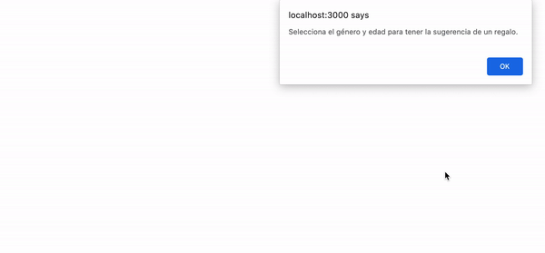

[`React Fundamentals`](../../README.md) > [`Sesión 05: Hooks y useEffect`](../Readme.md) > `Postwork`

#### REQUISITOS
- Haber completado el [Reto-01](../Reto-01).
- Haber completado el [Reto-02](../Reto-02).

#### DESARROLLO

1. Comenzar nuevo proyecto de React con el comando `npx create-react-app postwork`.

2. Seguir las [buenas prácticas para empezar un proyecto](../../BuenasPracticas/EmpezandoProyectos/Readme.md).

3. Imprime las instrucciones cuando el componente se monte.
	- `Selecciona el género y edad para tener la sugerencia de un regalo.`

4. Usa radio buttons, onClick, [switch](https://www.w3schools.com/js/js_switch.asp) y renderizado condicional.

5. Regalos:
	- Damas
		- Muñecas
		- Viajes
		- Operaciones
	- Caballero
		- Dinosaurios
		- Carro
		- Casa

6. Resultado

