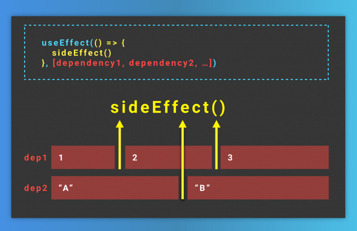

[`Backend Fundamentals`](../../README.md) > [`Sesión 05: Hooks y useEffect`](../Readme.md) > `Prework`

### OBJETIVO
- Convertir componentDidMount a hook.
- Convertir componentWillUnmount a hook.
- Convertir componentDidUpdate a hook.

#### DESARROLLO

> 💡 **Recuerda:**

Los **Hooks** son una **API** que nos permite usar **estado** y otras características en un **componente funcional.**

**Los componentes funcionales no podían tener estado, se utilizaban principalmente para:**
+ Componentes simples sin estado.
+ Estilos reutilizables.

Con la API de Hooks, los componentes funcionales pasan a tener el mismo potencial que los componentes de clases. Y de manera más declarativa y escueta.

Con el hook de `React useEffect` podemos especificar cuando queremos que un código determinado se ejecute:

+ Sólo una vez
+ Sólo cada vez que cambie una (o más) variables en concreto

En lugar de ejecutarse a cada renderizado de nuestro componente

+ `useEffect`  nos permite ejecutar un efecto secundario cuando se modifica una prop o un estado de useState.
+ `useEffect`  sustituye a las funciones de ciclo de vida:
  + componentDidMount
  + componentDidUpdate
  + componentWillUnmount.

  

## Para qué es útil el useEffect

Los hooks de React son herramientas muy potentes que nos sirven sobre todo para **extraer código** y poder **reutilizarlo** de manera muy **simple** y **agradable**.
El `useEffect` es la manera que tenemos en React de controlar y decidir cuándo queremos que se ejecute un código concreto

### Ejemplo

Vamos a introducir un `console.log()` en un componente que también tendrá un **botón**, y cada vez que lo apretemos actualizaremos un **contador** y esto **obligará** a React a **renderizar el componente otra vez.**

```js
import React, { useState } from 'react'
const Button = () => {
  console.log('hey yo')
  const [counter, setCounter] = useState(0)
  return (
    <div>
      <button onClick={() => setCounter(prev => prev + 1)}>contador: {counter}</button>
    </div>
  )
}
export default Button
```

> Cada vez que actualizamos el contador el componente Button se vuelve a renderizar y con ello vuelve a ejecutar el `console.log`

**Pero y ¿si queremos que este console.log sólo se ejecute una vez y al principio?**

**Exacto**, con el `useEffect`

>💡 **Nota**


Quizás está bien que cada vez que se apriete el botón se ejecute el `console.log`, pero a medida que vayamos añadiendo complejidad el número de renderizados crecerá, y entonces igualmente necesitaremos forzar que ese `console.log` **no se ejecute** siempre sino cuando nosotros queramos.

**¿Cómo controlamos que se ejecuta y cuándo se ejecuta dentro de un componente?**

```js
import React, { useState, useEffect } from 'react'
const Button = () => {
  useEffect(() => {
    console.log('hey yo')
  }, [])
  const [counter, setCounter] = useState(0)
  return (
    <div>
      <button onClick={() => setCounter(prev => prev + 1)}>contador: {counter}</button>
    </div>
  )
}
export default Button
```

Y aquí puedes ver como el `console.log` sólo se ejecuta una única vez, y aunque el componente se renderize mil veces sólo veremos una orden en la consola

Esto es así porque hemos encapsulado el código dentro de un `useEffect`, pero...

## ¿cómo funciona `useEffect` ?

+ La función se especifica de la siguiente manera

```js
La función se especifica así
useEffect(() => {
  console.log('hey yo')
}, [])
```

+ Tiene dos argumentos

```js
 useEffect(arg1, arg2)
```

+ El primer argumento es una **función**, y el código de adentro será el que ejecutemos.

+ El segundo argumento **define cuándo se ejecutará este código**, y es un **array** de dependencias, esto es todo lo que se encuentra dentro de este **array**, cuando cambie, se volverá a ejecutar el código del `useEffect`

### Pregunta, ¿cuántas veces se ejecutará este código?

```js
import React, { useState, useEffect } from 'react'
const Button = () => {
  const mivariable = 'soy indiferente'
  useEffect(() => {
    console.log('hey yo')
  }, [mivariable])
  const [counter, setCounter] = useState(0)
  return (
    <div>
      <button onClick={() => setCounter(prev => prev + 1)}>contador: {counter}</button>
    </div>
  )
}
export default Button
```

**Respuesta**

Las mismas veces que antes, porque la variable `mivariable` no cambiará nunca **(por lo tanto se ejecuta al principio y nunca más)**

Pero y si queremos **¿que se ejecute al apretar otro botón?** y la respuesta es la misma que anterior.

```js
import React, { useState, useEffect } from 'react'
const Button = () => {
  const [mivariable, setMivariable] = useState('soy indiferente')
  useEffect(() => {
    console.log(mivariable)
  }, [mivariable])
  const [counter, setCounter] = useState(0)
  return (
    <div>
      <button onClick={() => setCounter(prev => prev + 1)}>contador: {counter}</button>
      <button onClick={() => setMivariable('ya no')}>console.log('ya no')</button>
      <button onClick={() => setMivariable('soy otro')}>console.log('soy otro')</button>
    </div>
  )
}
export default Button
```

Al dar **click en el botón** `console.log` estaremos imprimiendo el console.log, pero si te fijas sólo lo hará la primera vez, las siguientes ya no.

Esto ocurre porque cuando hacemos un `setMivariable` **('ya no')** por segunda vez en realidad no estamos cambiando el estado (cambiarlo por el mismo contenido es lo mismo que no cambiarlo), por lo que no se ejecuta el `useEffect`

Por lo tanto y en conclusión, el `useEffect` es la manera React que tenemos para controlar cuándo se ejecuta un código determinado.

1. Leer el artículo ["Usando el Hook de efecto"](https://es.reactjs.org/docs/hooks-effect.html).

2. Leer el artículo ["Reglas de los Hooks"](https://es.reactjs.org/docs/hooks-rules.html).
