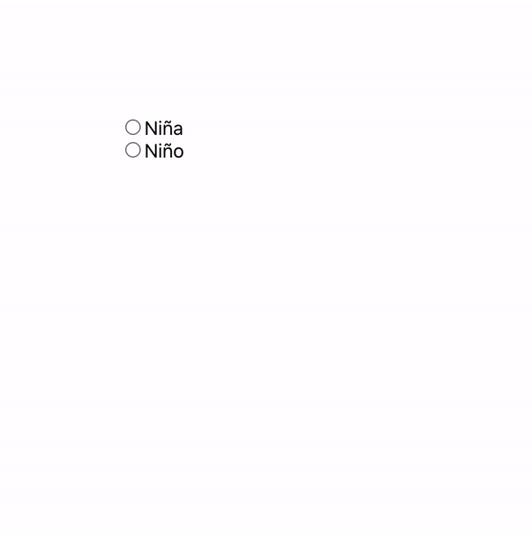

[`React Fundamentals`](../../README.md) > [`Sesión 05: Hooks y useEffect`](../Readme.md) >[`Ejemplo-01`](../Ejemplo-02) > `Reto 2`

## ¿Niño o niña?

### OBJETIVO
- Renderizado condicional

#### REQUISITOS
- Haber aprendido las maneras de renderizar condicionalmente.

#### DESARROLLO

1. Comenzar nuevo proyecto de React con el comando `npx create-react-app reto2`.

2. Seguir las [buenas prácticas para empezar un proyecto](../../BuenasPracticas/EmpezandoProyectos/Readme.md).

3. Usa radio buttons, onClick, CSS y renderizado condicional para mostrar el color rosa/azul y el sexo de la bendición.

4. Trata de usar mínimo 2 componentes y que uno reciba props, para que practiques clases pasadas también.

5. Resultado

## ❗Importante

Si no pudiste resolver el reto, no te preocupes,😉 en la parte superior del repositorio encontrarás los archivos con la solución para tu consulta, pero recuerda lo importante es que **tú lo intentes primero.** 🤓

[`Atrás`](https://github.com/beduExpert/C1-React-2020/tree/master/Sesion-05/Ejemplo-02)
