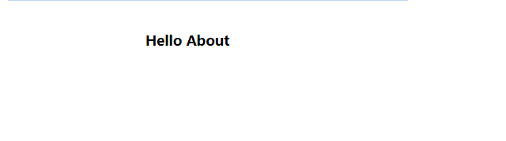

[`Backend Fundamentals`](../../README.md) > [`Sesión 06: Rutas con react router dom`](../Readme.md) > `Prework`

### OBJETIVO
- Saber que es `react router dom`.

#### DESARROLLO

## React Router

Seguramente habrás escuchado sobre [React Router](https://reactrouter.com) y si no es así el día de hoy vas aprender a trabajar con esta librería la cual nos ayuda con el manejo de rutas en nuestra aplicación.

Al día de hoy React Router se puede trabajar tanto para web como para móvil, siendo `react-router-dom` para web y `react-router-native` para móvil.

**¿Qué es React Router?**

React Router es una **colección de componentes** de navegación la cual podemos usar como ya lo mencionamos anteriormente tanto en web o en móvil con **React Native**. Con esta librería vamos a obtener un **enrutamiento dinámico** gracias a los componentes, en otras palabras tenemos unas rutas que **renderizan** un componente.

**Beneficios de React Router**

+ Establecer rutas en nuestra aplicación ej: Home, About, User.
+ Realizar redirecciones
+ Acceso al historial del navegador
+ Manejo de rutas con parámetros
+ Páginas para el manejo de errores como 404

## Componentes pilares de React Router

+ **BrowserRouter**

Este componente es el encargado de envolver nuestra aplicación dándonos acceso al **API** historial de **HTML5 (pushState, replaceState y el evento popstate)** para mantener su UI sincronizada con la URL.

+ **Switch**

Este componente es el encargado de que solo se **renderice el primer hijo Route** o **Redirect** que coincide con la ubicación. Si no usan este componente todos los componentes Route o Redirect se van a renderizar mientras cumplan con la condición establecida.

+ **Route**

Con Route podemos definir las **rutas de nuestra aplicación**, quizás sea el componente más importante de React Router para llegar a comprender todo el manejo de esta librería. Cuando definimos una ruta con Route le indicamos qué **componente debe renderizar**.
**Este componente cuenta con algunas propiedades.**

+ **Path:** la ruta donde debemos renderizar nuestro componente podemos pasar un string o un array de string.
Exact: Solo vamos a mostrar nuestro componente cuando la ruta sea exacta.
>**Ej:** /home === /home.
+ **Strict:** Solo vamos a mostrar nuestro componente si al final de la ruta tiene un slash.
>**Ej:** /home/ === /home/
+ **Sensitive:** Si le pasamos true vamos a tener en cuenta las mayúsculas y las minúsculas de nuestras rutas.
>**Ej:** /Home === /Home
+ **Component:** Le pasamos un componente para renderizar solo cuando la ubicación coincide. En este caso el componente se monta y se desmonta no se actualiza.
+ **Render:** Le pasamos una función para montar el componente en línea.

## Requisitos

Tener instalado **node.js** puede usar nvm para gestionar varias versiones de **node**.js, npm o yarn, manejo básico de la **terminal**, un editor de **código** como VScode.

## Instalación de React Router

Para instalar la librería solo tenemos que ir a la terminal estar ubicados en la **raíz de nuestro proyecto** y **ejecutar el siguiente comando.**

`npm install react-router-dom`
o
`yarn add react-router-dom`

## Trabajando con React Router

+ Primero vamos a **crear** nuestro proyecto

+ Para crear nuestro proyecto vamos a usar `create-react-app` para eso ejecutamos el siguiente comando en la terminal.
`npx create-react-app routes-react`

+ Esperamos que se **instale** y **cree** nuestro proyecto

+ Y accedemos desde la terminal con: `cd routes-react`

Si queremos probar nuestro proyecto podemos correr `npm start` o `yarn start` desde la terminal.

Teniendo todo listo ahora si vamos a nuestro editor de código y abrimos el archivo **App.js** que está ubicado en **src/App.js** acá vamos a limpiar muchas cosas hasta que al final tengamos algo como el siguiente código.

```js
import React from 'react';
import './App.css';
import {
  BrowserRouter as Router,
  Route
} from "react-router-dom";
import Home from './pages/Home'

function App() {
  return (
    <Router>
      <div className="App">
          <Route exact path="/" component={Home} />
      </div>
    </Router>
  );
}

export default App;
```

>💡**Nota:**
>
>Importamos nuestro componente `BrowserRouter` le damos un nombre **Router** también importamos Route de `react-router-dom`. Envolvemos nuestra aplicación con Router y definimos nuestra primera ruta en este caso nuestro home le indicamos que debe ser exacta la ruta y que haga render de nuestro componente Home pero.

**¿Dónde está nuestro componente Home?** bueno vamos a crearlo.

```js
// Home.js
import React from 'react'

const Home = () => (
  <section className="Home">
    <h3>Hello About</h3>
  </section>
)

export default Home
```

Este es nuestro componente **Home** que está dentro de una carpeta llamada **pages/Home** y solo tenemos un `h3` con un texto.
Si vamos al navegador a **http://localhost:3000/** vamos a ver solo el texto.



**Genial** 🎉, hemos construido nuestra primera ruta en React.

## Link

Con Link vamos a poder **navegar por nuestra aplicación**, este componente recibe las siguientes propiedades.

+ **To:** le podemos pasar un string, object o una function para indicarle la ruta a la cual queremos navegar.
+ **Replace:** cuando es verdadero, y hacemos clic en el enlace reemplazará la entrada actual en la pila del historial en lugar de agregar una nueva.

```js
<nav>
  <ul>
    <li>
      <Link to="/">Home</Link>
    </li>
	<li>
	  <Link to="/about">About</Link>
	</li>
	<li>
	  <Link to="/users">Users</Link>
	</li>
	<li>
	  <Link to="/hola-mundo">Hello</Link>
	</li>
  </ul>
</nav>
```

Agregamos el siguiente código en nuestro componente **App.js** dentro del **div** con la **clase App**, ahora podemos ver un menú de navegación en nuestra aplicación.
Nos falto mencionar que debemos hacer el **import** de **Link**.

```js
// App.js
import {
  BrowserRouter as Router,
  Switch,
  Route,
  Link
} from "react-router-dom";
```


Podemos concluir que React Router nos provee de todos los componentes necesarios para convertir nuestro proyecto en una **SPA(single page application)**  y obtener una navegación entre nuestros componentes sin perder el historial de navegación.

Espero haya sido de tu ayuda este artículo para comenzar o comprender un poco mejor el manejo de esta librería igualmente pueden ir a la [documentación oficial](https://reactrouter.com/web/guides/quick-start) en la cual pueden encontrar muchos más ejemplos y componentes que no se vieron en este artículo.
