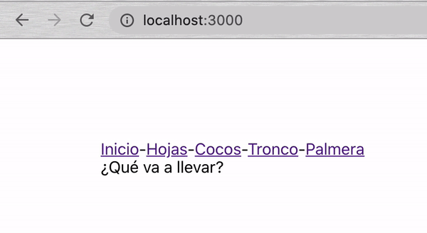

[`React Fundamentals`](../../README.md) > [`Sesión 06: Rutas con react router dom`](../Readme.md) >[`Ejemplo-01`](../Ejemplo-01) > `Reto 1`

## Palmera

### OBJETIVO
- react router dom.
- Componente anchor (a).
- Componente Link.
- Exact path.

#### REQUISITOS
- Tener Node instalado.

#### DESARROLLO

1. Comenzar nuevo proyecto de React con el comando `npx create-react-app reto1`.

2. Seguir las [buenas prácticas para empezar un proyecto](../../BuenasPracticas/EmpezandoProyectos/Readme.md).

3. Instalar la librería `react-router-dom`.

4. Crea 5 rutas para manejar una palmera y SOLAMENTE 5 componentes.
	- App
	- Header
	- Hojas
	- Cocos
	- Palmera

5. Resultado

## ❗Importante

Si no pudiste resolver el reto, no te preocupes,😉 en la parte superior del repositorio encontrarás los archivos con la solución para tu consulta, pero recuerda lo importante es que **tú lo intentes primero.** 🤓

[`Atrás`](https://github.com/beduExpert/C1-React-2020/tree/master/Sesion-06/Ejemplo-01)
