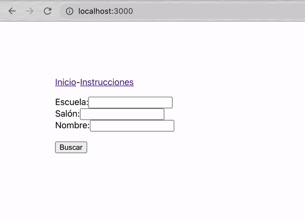
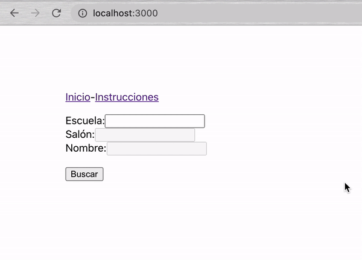
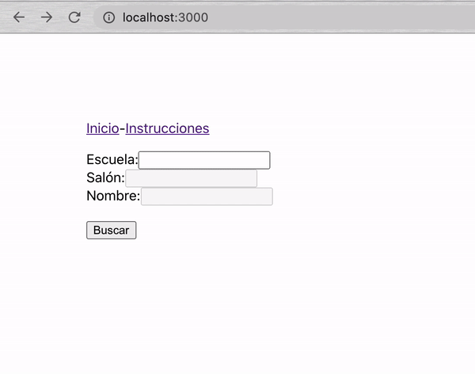
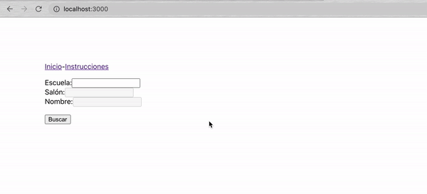

[`React Fundamentals`](../../README.md) > [`Sesión 06: Rutas con react router dom`](../Readme.md) >[`Ejemplo-02`](../Ejemplo-02) > `Reto 2`

## Buscando a Memo

### OBJETIVO
- react router dom.
- Componente Link.
- Parámetros por url.
- Exact path.

#### REQUISITOS
- Haber completado el [Ejemplo-02](../Ejemplo-02).

#### DESARROLLO

1. Comenzar nuevo proyecto de React con el comando `npx create-react-app reto2`.

2. Seguir las [buenas prácticas para empezar un proyecto](../../BuenasPracticas/EmpezandoProyectos/Readme.md).

3. Instalar la librería `react-router-dom`.

4. Usa `useState`, `useEffect`, manejadores de eventos (onChange, etc), `constants.js` y tu imaginación para completar todo lo siguiente.

5. Poder empezar a buscar directamente o desde las instrucciones.

6. Habilitar los `<input />`s solo cuando los de arriba tienen valor.

7. Desplegar los valores si es que existen.

8. Solo desplegar `salón` si `escuela` existe y `nombre` si `salón` existe.

9. Avisar cuando es Memo usando el `useEffect`.

## ❗Importante

Si no pudiste resolver el reto, no te preocupes,😉 en la parte superior del repositorio encontrarás los archivos con la solución para tu consulta, pero recuerda lo importante es que **tú lo intentes primero.** 🤓

[`Atrás`](https://github.com/beduExpert/C1-React-2020/tree/master/Sesion-06/Ejemplo-02)
