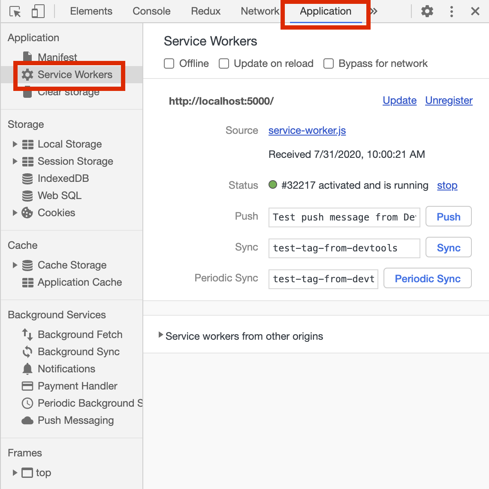
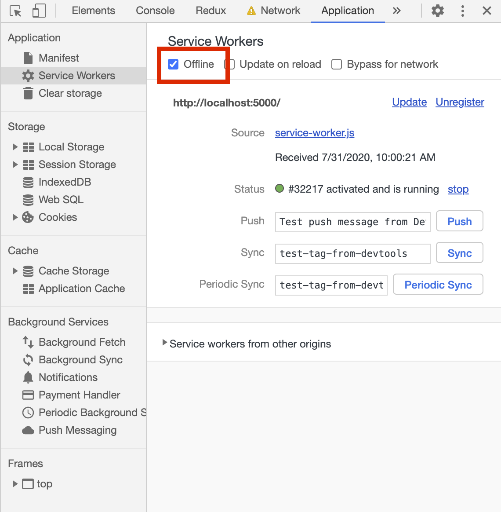
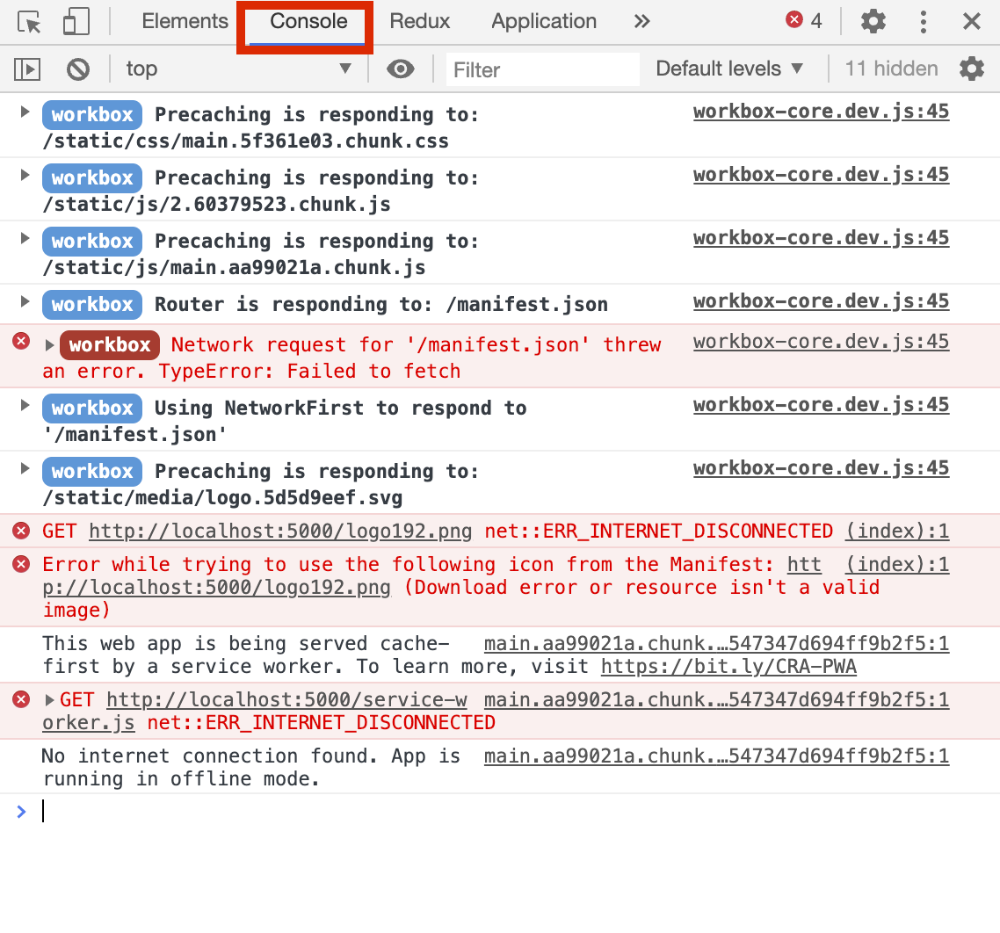
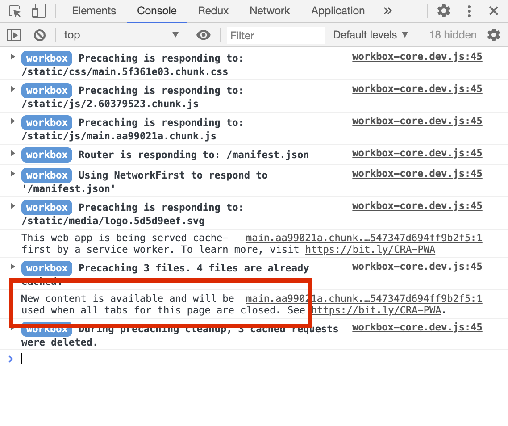
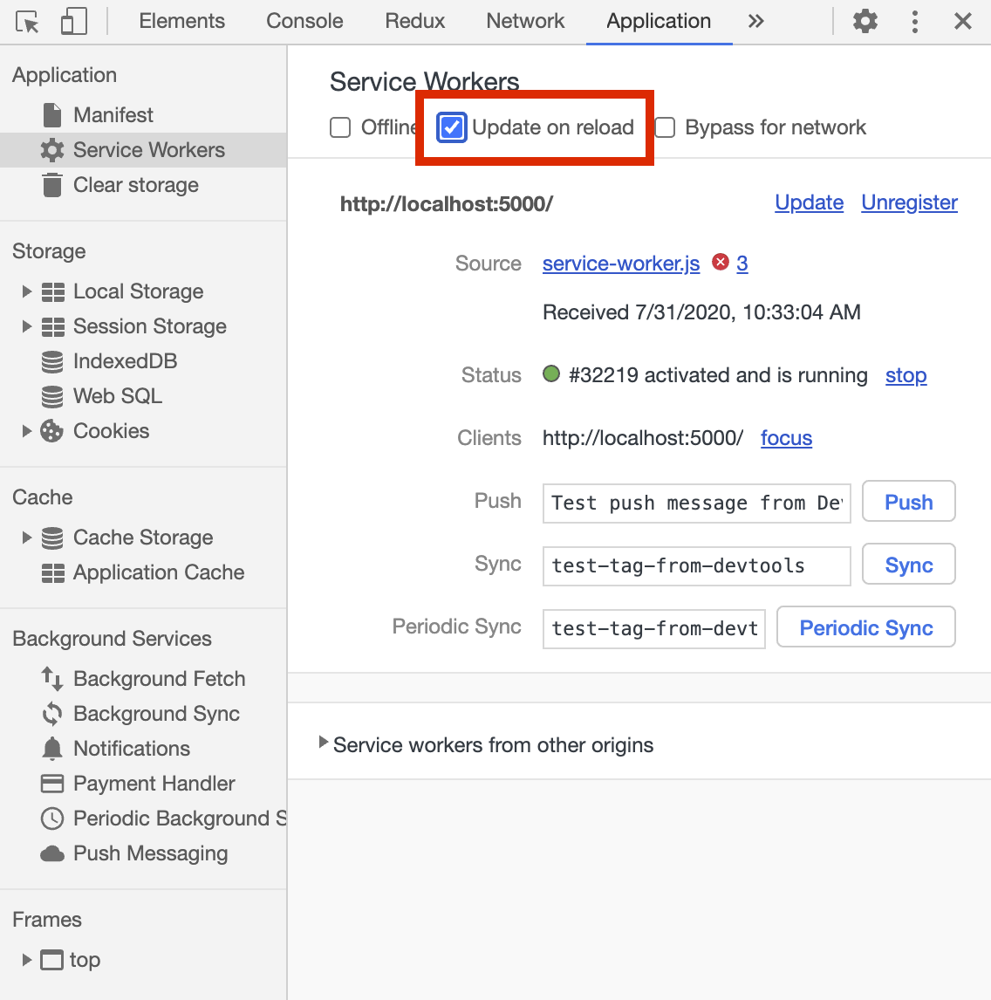
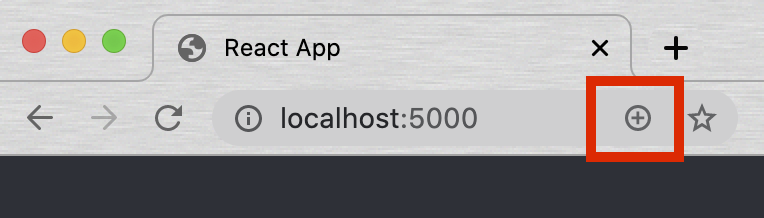
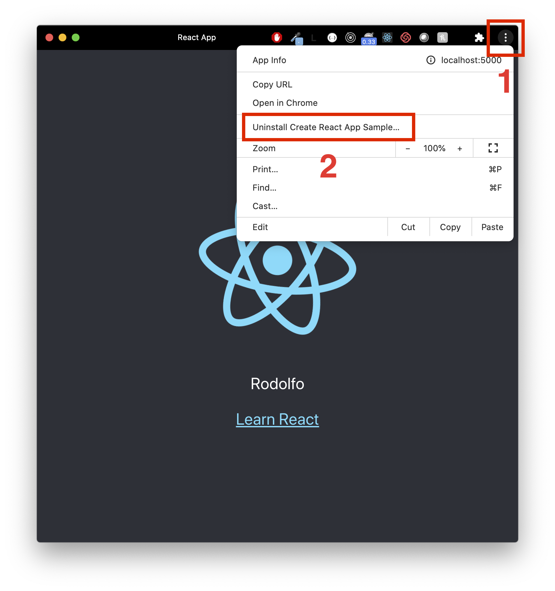
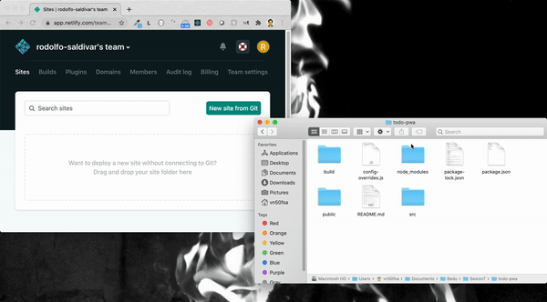
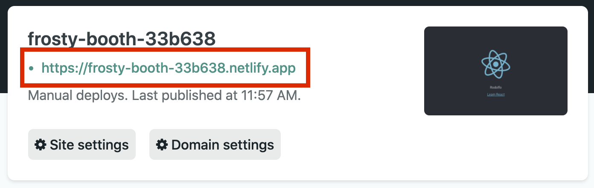

[`React Fundamentals`](../../README.md) > [`Sesión 07: Progressive web apps (PWA)`](../Readme.md) > `Ejemplo 1`

## ¡Wooow!

### OBJETIVO
- Configurar la aplicación react para hacerla progressive web app.
- Configurar un service worker.

#### REQUISITOS 
- Tener Node instalado.

#### DESARROLLO

1. Comenzar nuevo proyecto de React con el comando `npx create-react-app todo-pwa`.

2. Seguir las instrucciones para [configurar una PWA](../../BuenasPracticas/PWA/Readme.md).

3. Todas estas configuraciones nunca las vamos a ver en acción mientras estemos trabajando en desarrollo (`npm start` en `localhost:3000`). Solo van a poder ser visibles cuando la app este en producción (tenga su propio url).

4. PEEEERO, hay una forma de simular el ambiente de producción en `localhost`.

5. En la terminal escribimos `npm run build`. Este comando nos va a crear un folder en la carpeta raíz (`todo-pwa/build`) con los archivos preparados para producción.

6. Escribimos `npx serve -s build`. Este comando va a simular ser producción con lo que nuestro folder `build` tenga en ese momento.

7. Abre [localhost:5000](http://localhost:5000/) y verás la app corriendo como si fuera producción.

8. Para demostrar que el `service worker` esta activo y funcionando, abrimos la consola del navegador y vamos a la pestaña de `Application`. Ahí vamos a ver nuestro `service worker` registrado y corriendo.

9. Como también configuramos que funcione sin internet, podemos simular esto en la consola de igual forma. Le damos click a `offline` en la consola del navegador y recargamos.

10. Si vamos a la consola, podemos ver que esta precargando lo que tiene en `cache` y hasta el último nos esta diciendo que esta en modo `offline`.

11. Regresa al paso 9 y quítale el modo `offline`.

12. Abre `App.js` y escribe tu nombre dentro del `
` debajo de la ``. Guardalo y regresa a ver los cambios.

13. Si te fijas, los cambios no se ven reflejados en el navegador. Esto pasa porque lo que estamos viendo en [localhost:5000](http://localhost:5000/) es lo que la carpeta `build` tiene en ese momento. Entonces tenemos que volver a hacer los pasos 5 y 6 cada vez que queramos ver reflejado los nuevos cambios.

14. Repite los pasos 5 (`npm run build`) y 6 (`npx serve -s build`).

15. ¿Por qué no se esta actualizando y nos muestra la versión pasada? Porque como el `service worker` esta guardado en cache, esta mostrando la versión pasada. Incluso en la misma consola nos esta diciendo que tiene una nueva versión y que necesitamos recargar la página.

16. Para resolver esto, habilitamos la actualización al recargar.

17. Y ahora la mejor parte de las PWA, instalación en todos los dispositivos.

18. A simple vista, la manera de identificar si un sitio web es una PWA es ver si se puede instalar o no. Esto podemos verlo hasta el final del url. Si aparece un signo de `+` es porque es una PWA.

19. Instala la app y verás que ahora estará en la computadora como si fuera una aplicación de escritorio. Increible.

20. Para desinstalarla sigue los siguientes pasos:

21. También se puede instalar en [Android](https://www.youtube.com/watch?v=kUsqZ9NYB2Y) y [IOS](https://www.youtube.com/watch?v=qtrRqzbXFtE).

22. Ahora vamos a publicar nuestra app en internet con un proveedor gratis y de una manera muuuuuuy facil.

23. Vamos a la página [Netlify](https://www.netlify.com/) y creamos una cuenta.

24. Una vez adentro, agarramos y arrastramos nuestra carpeta `build` dentro del recuadro.

25. Abre el url de la app y listo, ya tenemos nuestra React PWA en internet.

[`Siguiente: Reto-01`](../Reto-01)
