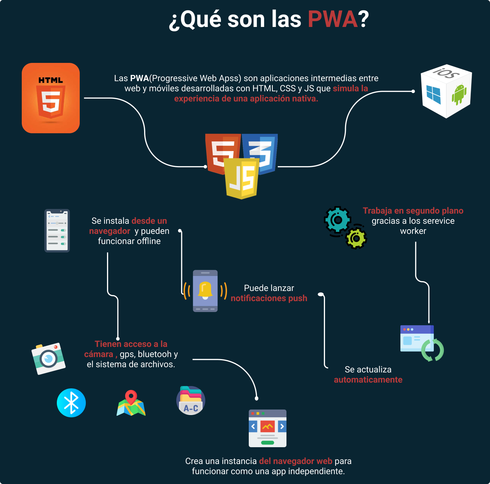
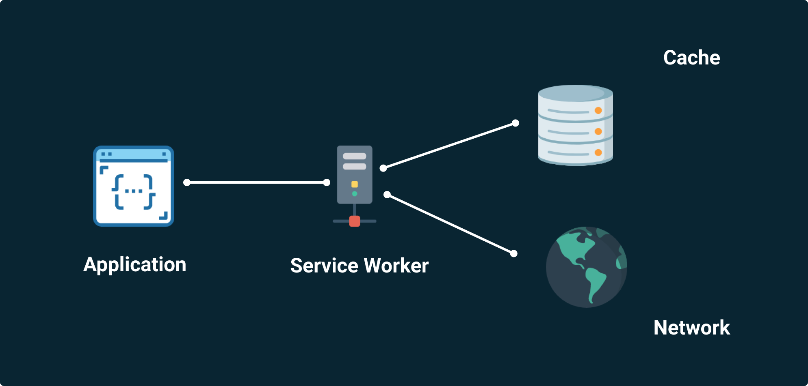
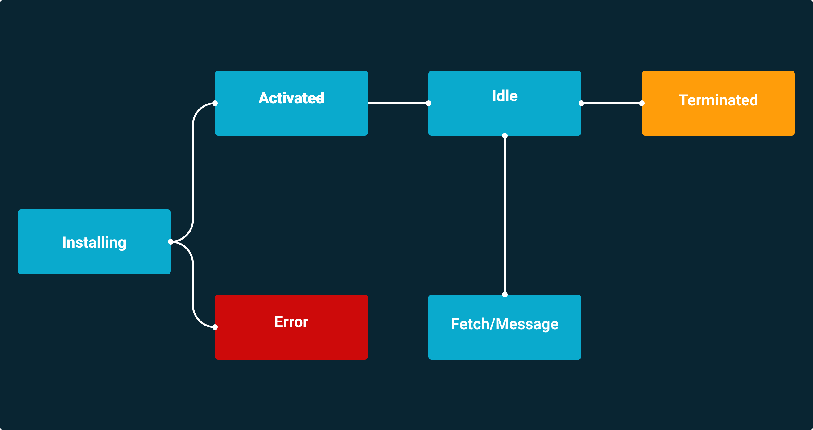
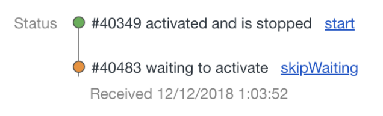

[`Backend Fundamentals`](../../README.md) > [`Sesión 07: Progressive web apps (PWA)`](../Readme.md) > `Prework`

### OBJETIVO
- Conocer qué es una PWA.

#### DESARROLLO

**Podemos empezar por lo que no son las PWAs:**

+ No es una extensión de navegadores web
+ No es un framework como React, Vue, Angular
+ No es un plugin o librería para los frameworks
+ No es parecido a React Native, Native Script, ionic, etc.
+ No es sólo Responsive Design

**Pero, entonces ...**

**PWA** o Progressive web apps (aplicaciones web progresivas), es un término que se da a una nueva generación de aplicaciones que incrementan su funcionalidad, conforme las capacidades del dispositivo en el que se ejecutan e incrementan, de ahí la palabra progresiva.

La siguiente parte del nombre web, hace referencia a que se construyen utilizando estándares de desarrollo web, algunos ya conocidos como **HTML**, **CSS** y **JavaScript**;  una nueva generación de **APIs** de javaScript. La parte final app es porque las Progressive Web Apps se comportan como aplicaciones **web nativas**, pero usan tecnologías web.

## ¿Cómo funciona una PWA?

Las **PWAs** son el compromiso perfecto entre un sitio web y una **aplicación nativa**. Su modo de funcionamiento se basa en la combinación exclusiva de conceptos ya existentes que, puestos en común les permiten alcanzar rendimientos excelentes:

### La App Shell

Se trata, por así decirlo, del caparazón de tu aplicación, en la cual se difunden tus datos. Se constituye de bases **HTML**, **CSS** y **JavaScript** necesarias para el funcionamiento del interfaz de usuario.

El uso de una arquitectura de tipo App Shell permite a estos parámetros, muy ligeros, de ser cargados de manera muy rápida durante la primera visita, lo que reduce significativamente el tiempo de primera visualización.

### Service Worker

​Se trata de la base técnica de numerosas funcionalidades que distinguen las PWAs de los **sitios web clásicos**. Se posiciona entre la **app** y el **navegador** (o de la red cuando está disponible) y puede fuertemente modificar el comportamiento de la app gracias a las numerosas posibilidades que ofrece.

## Manifiesto JSON

Un manifiesto es un fichero que contiene **metadatos** relacionados a los otros ficheros que describe. Se trata de un fichero descriptivo que permite **renderizar** de una forma nativa a la aplicación con una visualización de pantalla completa, iconos identificables con la posibilidad de modificar la orientación de la pantalla y sobre todo la posibilidad de **instalar** la aplicación en la pantalla de inicio de los usuarios.

## Ciclo de vida de un service worker

### Installing:

Lo primero que sucede cuando se registra un nuevo service worker es el evento de installing. Al instalarse toma control sobre la **página en el navegador**.

Este es un buen momento para definir qué archivos se guardarán en el caché.

>💡 **Nota:**
>
>Podemos abrir y nombrar diferentes caches para manejarlos de forma independiente.

Solo puede haber **un service worker** instalado a la vez, por lo que si ya hay uno registrado, el **nuevo esperará** a que todas las pestañas con esa página están cerradas para poder instalarse, mientras tanto quedará en un estado de espera.

### Activated

Si todo sale bien con la instalación, se dispara el evento **activated**.

Podemos estar seguros de que nuestro service worker tomó **control de la página**.

Este es un buen momento para **borrar los caches de antiguas versiones** del service worker que ya no utilizaremos.

### Idle

Cuando un service worker está activo, pero no recibe peticiones, entra a un **estado de espera**. Desde aquí puede saltar a cualquiera de los siguientes dos estados y regresar.

### Fetch/Message

Al momento de hacer una petición desde el cliente o cuando se manda un **push message** desde el **backend**, nuestro service worker **recibirá un evento** que podemos escuchar para decidir cómo responder.

Aquí es donde se define la estrategia de respuesta (Cache first, cache only, network first, network only, etc).

### Terminated

Cuando un service worker permanece en **estado idle** por mucho tiempo, para liberar la carga que ejerce sobre el navegador, entra a un estado llamado *terminated* en donde se **duerme**. En este momento olvida los caches que se hayan guardado pero se mantiene atento para volver a activarse en cuanto reciba cualquier otro evento.

[12 Best Examples of Progressive Web Apps (PWAs) in 2020](https://www.simicart.com/blog/progressive-web-apps-examples/)

1. Leer el artículo ["Introduccion a progressive web apps"](https://developer.mozilla.org/es/docs/Web/Progressive_web_apps/Introduction).

2. Leer [cómo una Progressive Web App revolucionará tu negocio](https://www.tu-app.net/progressive-web-apps/).
