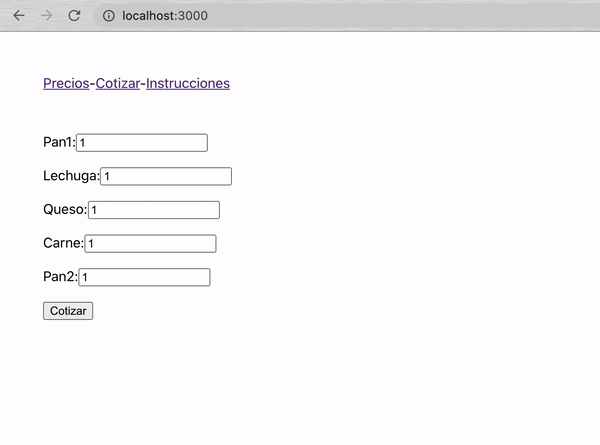
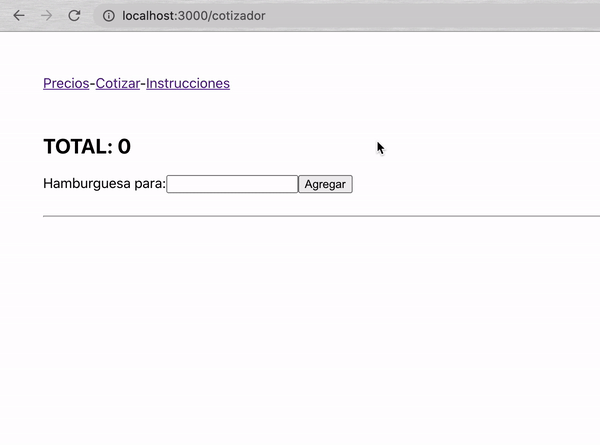
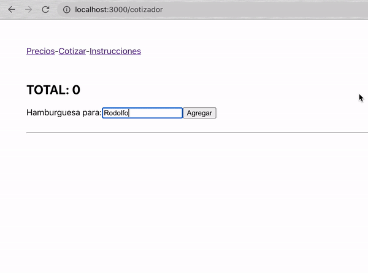
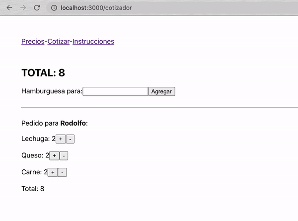
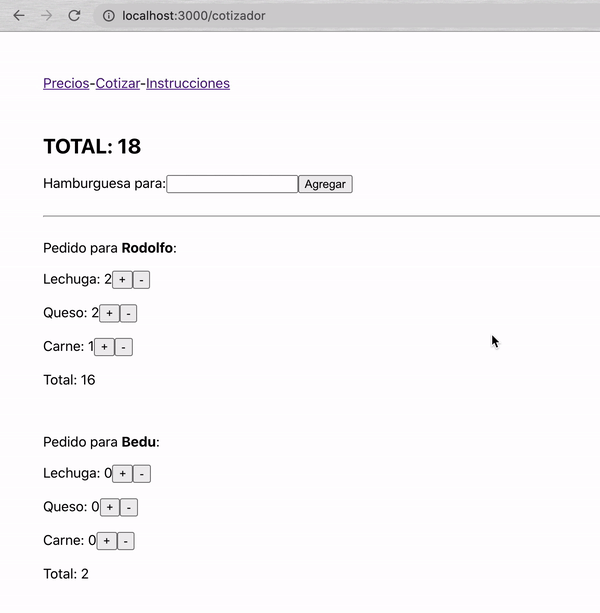

[`React Fundamentals`](../../README.md) > [`Sesión 07: Progressive web apps (PWA)`](../Readme.md) >[`Ejemplo-01`](../Ejemplo-01) > `Reto 1`

## ¿Hamburguesas o qué?

### OBJETIVO
- Practicar todo lo aprendido.

#### REQUISITOS
- Tener Node instalado.

#### DESARROLLO

1. Comenzar nuevo proyecto de React con el comando `npx create-react-app reto1`.

2. Seguir las buenas prácticas necesarias para todo lo que hagas.

3. Hoy te toca pagar la cena y quieres saber cuanto va a costar.

4. Crea una PWA para calcular el costo de comprar 1 hamburguesa por persona para varias personas.

5. TODO debe de ser dinámico: precios, nombres y cantidad de ingredientes.

6. Los ingredientes tienen un precio de $1 por defecto y son:
	- pan1 (arriba)
	- lechuga
	- queso
	- carne
	- pan2 (abajo)

7. Para esta app, las hamburguesas SIEMPRE llevan pan1 y pan2 como mínimo, los demas ingrediente son ilimitados.

8. Ten mucho cuidado de no mutar la información. Para esto te recomiendo instalar y usar la librería [`immutable`](https://immutable-js.github.io/immutable-js/docs/#/). Solo vas a necesitar usar [`setIn()`](https://immutable-js.github.io/immutable-js/docs/#/setIn) para este reto, puedes usar otras cosas de la librería si gustas.

9. Mira todos los objetivos antes de empezar, piensa en un plan para completar todos y usa todo lo que hemos visto hasta esta sesión.

10. Es un reto difícil, por lo que te recomiendo preguntar e idear junto con los demás.

#### OBJETIVOS

1. Vas a necesitar un `estadoGlobal` que vas a pasar a la mayoría o a todos los componentes; tambien la función para actualizarlo.

2. Usar `react-router-dom` para navegar entre precios, cotizador e instrucciones.

3. No se puede agregar una persona si el nombre esta vacio.

4. Cada que una persona se agregue y/o modifique, se debe de actualizar el total de la compra así como el total de la hamburguesa individual.

5. Si los precios se modifican y hay personas con pedidos, los totales deben de actualizarse también. Incluso cuando se sumen o resten ingredientes después de eso.

6. No se aceptan números negativos para ingredientes.

7. Todo lo anterior incluye si hay varias personas.

8. Configurarla como PWA y publicarla en internet.

9. Se pueden usar todas las [buenas prácticas](../../BuenasPracticas) que hemos visto.

10. Hay muchas otra validaciones que se pueden hacer, pero con las mencionadas es suficiente.

11. En dado caso que no hayas completado el reto, ve, analiza, entiende y practica con el resultado que puedes encontrar en esta misma carpeta.

## ❗Importante

Si no pudiste resolver el reto, no te preocupes,😉 en la parte superior del repositorio encontrarás los archivos con la solución para tu consulta, pero recuerda lo importante es que **tú lo intentes primero.** 🤓

[`Atŕas`](https://github.com/beduExpert/C1-React-2020/tree/master/Sesion-07/Ejemplo-01)
