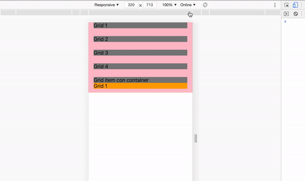

## App responsiva

### OBJETIVO
- Material UI
- Grids

#### REQUISITOS 
- Tener Node instalado.

#### DESARROLLO

1. Comenzar nuevo proyecto de React con el comando `npx create-react-app ejemplo1`.

2. Seguir las [buenas prácticas para empezar un proyecto](../../BuenasPracticas/EmpezandoProyectos/Readme.md).

3. Instalamos Material UI con `npm install @material-ui/core` y cuando termine, la comenzamos con `npm start`.

4. Esta librería nos permite implementar componentes reutilizables, y uno de estos componentes es `Grid`. Este nos ayuda a crear apps responsivas que se vean bien en todos los dispositivos (celular, tablet, etc.).

5. Importamos los componentes que vamos a necesitar de la librería.
```
import Grid from '@material-ui/core/Grid';
import Container from '@material-ui/core/Container';
``` 

6. Reemplazamos nusetro `div` por un `Container`.
```
import React from 'react';
import Grid from '@material-ui/core/Grid';
import Container from '@material-ui/core/Container';

const App = () => {
   return (
      <Container>
         Hola Mundo!
      </Container>
   );
};

export default App;
```

7. Creamos una clase css y la asignamos para ver como se comportan los espacios.
```
.container {
   background-color: pink;
}
```

8. Ahora vamos a crear un `Grid` contenedor que tenga 4 `Grid`s para que respondan dependiendo de la pantalla en donde se visualizan.
```
import React from 'react';
import Grid from '@material-ui/core/Grid';
import Container from '@material-ui/core/Container';

const App = () => {
   return (
      <Container className="container">
         <Grid container>
            <Grid item>
               Grid 1
            </Grid>
            <Grid item>
               Grid 2
            </Grid>
            <Grid item>
               Grid 3
            </Grid>
            <Grid item>
               Grid 4
            </Grid>
         </Grid>
      </Container>
   );
};

export default App;
```

9. Por el momento solo vemos los `Grid`s pegados porque no le hemos definido que tanto ancho deben de tener, vamos a hacerlo.
```
import React from 'react';
import Grid from '@material-ui/core/Grid';
import Container from '@material-ui/core/Container';

const App = () => {
   return (
      <Container className="container">
         <Grid container>
            <Grid item lg={3} md={4} sm={6} xs={12}>
               Grid 1
            </Grid>
            <Grid item lg={3} md={4} sm={6} xs={12}>
               Grid 2
            </Grid>
            <Grid item lg={3} md={4} sm={6} xs={12}>
               Grid 3
            </Grid>
            <Grid item lg={3} md={4} sm={6} xs={12}>
               Grid 4
            </Grid>
         </Grid>
      </Container>
   );
};

export default App;
```

10. Hay que recordar que la pantalla es dividida en 12 columnas, por lo que el número que le asignamos es la cantidad de columnas que se asignara para cada elemento. Si queremos poner 4 cajas por fila hacemos 12/4=3 (como con `lg`). Si queremos 2 cajas por fila hacemos 12/2=6 (como en `sm`).

11. Creamos otro css, envolvemos los textos en `div` y lo asignamos.
```
.gridItem {
   background-color: gray;
}
```

```
import React from 'react';
import Grid from '@material-ui/core/Grid';
import Container from '@material-ui/core/Container';

const App = () => {
   return (
      <Container className="container">
         <Grid container>
            <Grid item lg={3} md={4} sm={6} xs={12}>
               <div className="gridItem">
                  Grid 1
               </div>
            </Grid>
            <Grid item lg={3} md={4} sm={6} xs={12}>
               <div className="gridItem">
                  Grid 2
               </div>
            </Grid>
            <Grid item lg={3} md={4} sm={6} xs={12}>
               <div className="gridItem">
                  Grid 3
               </div>
            </Grid>
            <Grid item lg={3} md={4} sm={6} xs={12}>
               <div className="gridItem">
                  Grid 4
               </div>
            </Grid>
         </Grid>
      </Container>
   );
};

export default App;
```

12. El `<Grid container />` tiene un atributo que hace que todos los `<Grid item />` se separen y se ordenen.
```
...
<Grid container spacing={3}>
...
```

13. Si te fijas, ahora todos los `<Grid item />` tienen un padding adicional que hace que se separen. El atributo de `spacing` es opcional.

14. Los mismos `<Grid item />` pueden tener dentro de ellos otros `<Grid container />` para seccionar solo dentro de su cuadro.

15. Creamos otro contenedor dentro de otro `item`.
```
import React from 'react';
import Grid from '@material-ui/core/Grid';
import Container from '@material-ui/core/Container';

const App = () => {
   return (
      <Container className="container">
         <Grid container spacing={3}>
            <Grid item lg={3} md={4} sm={6} xs={12}>
               <div className="gridItem">
                  Grid 1
               </div>
            </Grid>
            <Grid item lg={3} md={4} sm={6} xs={12}>
               <div className="gridItem">
                  Grid 2
               </div>
            </Grid>
            <Grid item lg={3} md={4} sm={6} xs={12}>
               <div className="gridItem">
                  Grid 3
               </div>
            </Grid>
            <Grid item lg={3} md={4} sm={6} xs={12}>
               <div className="gridItem">
                  Grid 4
               </div>
            </Grid>

            <Grid item sm={6} xs={12}>
               <div className="gridItem">
                  Grid item con container
                  <Grid container>
                     <Grid item lg={3} md={4} sm={6} xs={12}>
                        <div>
                           Grid 1
                        </div>
                     </Grid>
                  </Grid>
               </div>
            </Grid>
         </Grid>
      </Container>
   );
};

export default App;
```

16. Creamos otra clase css y la asignamos.
```
.anidado {
   background-color: orange;
}
```

```
...
<Grid item sm={6} xs={12}>
   <div className="gridItem">
      Grid item con container
      <Grid container>
         <Grid item lg={3} md={4} sm={6} xs={12}>
            <div className="anidado">
               Grid 1
            </div>
         </Grid>
      </Grid>
   </div>
</Grid>
...
```

17. Como estamos en pantalla de laptop la resolución es de `lg`, por lo que 12/3=4.
Entonces el `Grid` contenedor anidado esta tomando 1/4 del espacio del otro `Grid` que es un `item`.

18. Haz más pequeña y más grande la pantalla para ver como se acomodan y cambian.

19. Resultado:


