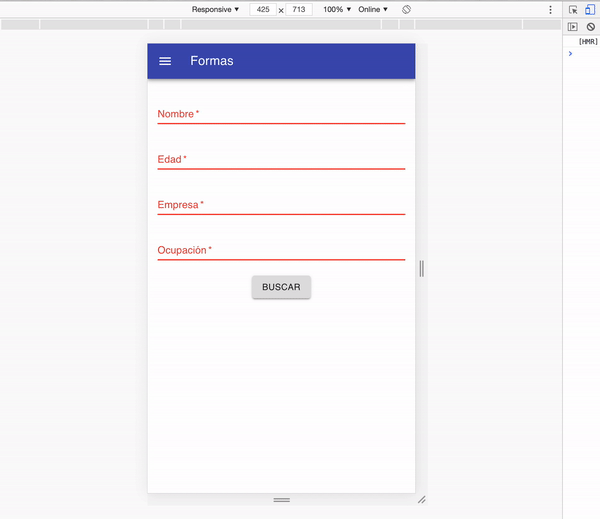

## Forma

### OBJETIVO
- Material UI
- Grids
- Formas

#### REQUISITOS 
- Tener Node instalado.

#### DESARROLLO

1. Comenzar nuevo proyecto de React con el comando `npx create-react-app ejemplo2`.

2. Seguir las [buenas prácticas para empezar un proyecto](../../BuenasPracticas/EmpezandoProyectos/Readme.md).

3. Instalamos Material UI con `npm install @material-ui/core` y Material UI Icons con `npm install @material-ui/icons`; cuando terminen, la comenzamos con `npm start`.

4. Creamos un componente nuevo llamado `Header.js`.

5. Buscamos el componente de [`App Bar`](https://material-ui.com/components/app-bar) y copiamos el código del `Simple App Bar` dentro de `Header.js`. Despues de acomodar el código a nuestro estilo y de ordenarlo, nos debe de quedar así.
```
import React from 'react';
import { makeStyles } from '@material-ui/core/styles';
import AppBar from '@material-ui/core/AppBar';
import Toolbar from '@material-ui/core/Toolbar';
import Typography from '@material-ui/core/Typography';
import Button from '@material-ui/core/Button';
import IconButton from '@material-ui/core/IconButton';
import MenuIcon from '@material-ui/icons/Menu';

const useStyles = makeStyles((theme) => ({
   root: {
      flexGrow: 1,
   },
   menuButton: {
      marginRight: theme.spacing(2),
   },
   title: {
      flexGrow: 1,
   },
}));

const Header = () => {
   const classes = useStyles();

   return (
      <div className={classes.root}>
         <AppBar position="static">
            <Toolbar>
               <IconButton
                  edge="start"
                  className={classes.menuButton}
                  color="inherit"
                  aria-label="menu"
               >
                  <MenuIcon />
               </IconButton>
               <Typography variant="h6" className={classes.title}>
                  News
               </Typography>
               <Button color="inherit">Login</Button>
            </Toolbar>
         </AppBar>
      </div>
   );
};

export default Header;
```

6. Quitamos el boton de `Login` y cambiamos el título a `Formas`.
```
...
<Typography variant="h6" className={classes.title}>
   Formas
</Typography>
...
```

7. Si te fijas, ahora estamos usando estilos dentro de nuestro componente con la ayuda de material ui. Vamos a darle un `marginBottom` al estilo de root.
```
...
root: {
   flexGrow: 1,
   marginBottom: theme.spacing(3)
},
...
```

8. Importamos `Header.js` dentro de `App.js`, importamos `Container` y acomodamos de la siguiente manera.
```
import React from 'react';
import Container from '@material-ui/core/Container';
import Header from './Header';

const App = () => {
   return (
      <div>
         <Header />
         <Container>
            Hola
         </Container>
      </div>
   );
};

export default App;
```

9. Creamos componente `Forma.js` y lo importamos dentro del `Container`.
```
import React from 'react';
import Container from '@material-ui/core/Container';
import Header from './Header';
import Forma from './Forma';

const App = () => {
   return (
      <div>
         <Header />
         <Container>
            <Forma />
         </Container>
      </div>
   );
};

export default App;
```

10. Dentro del componente `Forma.js` vamos a pedir el nombre, edad, empresa y ocupación. En material ui buscamos [`Text Field`](https://material-ui.com/components/text-fields/).

11. Importamos `Grid` y `TextField` y hacemos que los inputs sean responsivos. No olvides de ponerle `fullWidth` a los `TextField`.
```
import React from 'react';
import Grid from '@material-ui/core/Grid';
import TextField from '@material-ui/core/TextField';

const Forma = () => {
   return (
      <Grid container spacing={3}>
         <Grid item xs={12} sm={6} md={3}>
            <TextField label="Nombre" fullWidth />
         </Grid>

         <Grid item xs={12} sm={6} md={3}>
            <TextField label="Edad" type="number" fullWidth />
         </Grid>

         <Grid item xs={12} sm={6} md={3}>
            <TextField label="Empresa" fullWidth />
         </Grid>

         <Grid item xs={12} sm={6} md={3}>
            <TextField label="Ocupación" fullWidth />
         </Grid>
      </Grid>
   );
};

export default Forma;
```

12. Ahora vamos a manejar los valores con el estado.
```
import React from 'react';
import Grid from '@material-ui/core/Grid';
import TextField from '@material-ui/core/TextField';

const Forma = () => {
   const [nombre, setNombre] = React.useState('');
   const [edad, setEdad] = React.useState('');
   const [empresa, setEmpresa] = React.useState('');
   const [ocupacion, setOcupacion] = React.useState('');

   return (
      <Grid container spacing={3}>
         <Grid item xs={12} sm={6} md={3}>
            <TextField
               label="Nombre"
               fullWidth
               value={nombre}
               onChange={(e) => setNombre(e.target.value)}
            />
         </Grid>

         <Grid item xs={12} sm={6} md={3}>
            <TextField
               label="Edad"
               type="number"
               fullWidth
               value={edad}
               onChange={(e) => setEdad(e.target.value)}
            />
         </Grid>

         <Grid item xs={12} sm={6} md={3}>
            <TextField
               label="Empresa"
               fullWidth
               value={empresa}
               onChange={(e) => setEmpresa(e.target.value)}
            />
         </Grid>

         <Grid item xs={12} sm={6} md={3}>
            <TextField
               label="Ocupación"
               fullWidth
               value={ocupacion}
               onChange={(e) => setOcupacion(e.target.value)}
            />
         </Grid>
      </Grid>
   );
};

export default Forma;
```

13. Ahora vamos a hacer que los 4 valores sean requeridos. Replicamos en los 4.
```
...
<TextField
   label="Nombre"
   fullWidth
   value={nombre}
   onChange={(e) => setNombre(e.target.value)}
   required
   error={!nombre}
/>
...
```

14. Importamos y creamos un `Button` hasta el final del container.
```
...
import Button from '@material-ui/core/Button';
...
<Grid item xs={12} align="center">
   <Button variant="contained">Buscar</Button>
</Grid>
```

15. Creamos la funcionalidad y validación del botón.
```
...
const handleBuscar = () => {
   if (!nombre || !edad || !empresa || !ocupacion) return;

   setTimeout(() => {
      alert('Si se encuentra.');
   }, 1000);
};
...
<Button variant="contained" onClick={handleBuscar}>
   Buscar
</Button>
...
```

16. Código completo.
```
import React from 'react';
import Grid from '@material-ui/core/Grid';
import TextField from '@material-ui/core/TextField';
import Button from '@material-ui/core/Button';

const Forma = () => {
   const [nombre, setNombre] = React.useState('');
   const [edad, setEdad] = React.useState('');
   const [empresa, setEmpresa] = React.useState('');
   const [ocupacion, setOcupacion] = React.useState('');

   const handleBuscar = () => {
      if (!nombre || !edad || !empresa || !ocupacion) return;

      setTimeout(() => {
         alert('Si se encuentra.');
      }, 1000);
   };

   return (
      <Grid container spacing={3}>
         <Grid item xs={12} sm={6} md={3}>
            <TextField
               label="Nombre"
               fullWidth
               value={nombre}
               onChange={(e) => setNombre(e.target.value)}
               required
               error={!nombre}
            />
         </Grid>

         <Grid item xs={12} sm={6} md={3}>
            <TextField
               label="Edad"
               type="number"
               fullWidth
               value={edad}
               onChange={(e) => setEdad(e.target.value)}
               required
               error={!edad}
            />
         </Grid>

         <Grid item xs={12} sm={6} md={3}>
            <TextField
               label="Empresa"
               fullWidth
               value={empresa}
               onChange={(e) => setEmpresa(e.target.value)}
               required
               error={!empresa}
            />
         </Grid>

         <Grid item xs={12} sm={6} md={3}>
            <TextField
               label="Ocupación"
               fullWidth
               value={ocupacion}
               onChange={(e) => setOcupacion(e.target.value)}
               required
               error={!ocupacion}
            />
         </Grid>

         <Grid item xs={12} align="center">
            <Button variant="contained" onClick={handleBuscar}>
               Buscar
            </Button>
         </Grid>
      </Grid>
   );
};

export default Forma;
```

17. Resultado:


